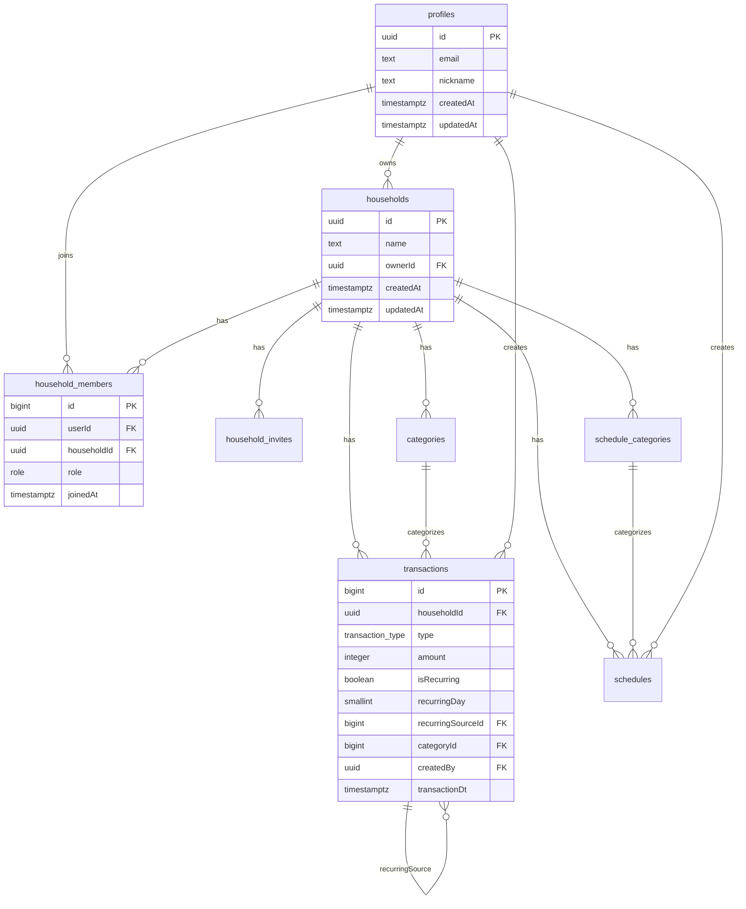

# 아키텍처

`moa-web`의 구조·데이터 모델·규약. 제품 요구사항은 [PRD.md](./PRD.md), 인증 흐름은 [authOnboarding.md](./authOnboarding.md), 알려진 개선 과제는 [improvements.md](./improvements.md)를 참고한다.

## 기술 스택

| 영역 | 선택 | 비고 |
| ---- | ---- | ---- |
| 프레임워크 | Next.js 16 (App Router) + React 19 + TypeScript 5.9 | `pages/`는 App Router 이전 관례가 아니라 FSD `src/pages` 레이어와 이름이 겹치지 않도록 남겨둔 빈 디렉터리(README만 존재) |
| 개발 서버 | `next dev --turbopack` | |
| 프로덕션 빌드 | `next build --webpack` | `@ducanh2912/next-pwa`가 webpack 기반이라 빌드만 webpack 사용. **dev(turbopack)와 build(webpack)의 번들러가 다르다** — PWA 관련 프로덕션 전용 문제가 dev에서 재현되지 않을 수 있다 |
| 스타일 | CSS Modules(`*.module.css`) + `src/shared/styles/globals.css`의 CSS 변수 | Tailwind 미사용 |
| 상태 관리 | Zustand 5(클라이언트) + TanStack Query 5(서버) | |
| 차트 | ECharts 6 (`echarts/core` + 필요 모듈만 등록) + `echarts-for-react/lib/core` | 화면마다 별도 등록 모듈 사용(아래 참고) |
| 백엔드/인증 | Supabase (`@supabase/ssr`, `@supabase/supabase-js`) | |
| PWA | `@ducanh2912/next-pwa` | |
| 패키지 매니저 | pnpm | |
| 스키마 검증 | 미도입 (zod 없음) | Supabase 응답도 타입 생성 없이 수동 타입 단언 — [improvements.md](./improvements.md) |
| 테스트 | Vitest 5 + `@testing-library/react`/`jest-dom`, 환경 `jsdom` | 설정은 완비돼 있으나 테스트 파일은 아직 0개 — [improvements.md](./improvements.md) |

## FSD 레이어 구조

```
app → pages → widgets → features → entities → shared
```

상위 레이어만 하위 레이어를 import한다. 역방향·동일 레이어 간 직접 참조는 금지된다. 이 규칙은 현재 **린트로 강제되지 않고**(`eslint-plugin-boundaries` 미설치) 컨벤션으로만 지켜지고 있으며, 실측 결과 역방향·동일 레이어 위반은 0건이다.

| 레이어 | 역할 |
| ------ | ---- |
| `app/` | Next.js 라우트. 대부분 `src/pages`의 컴포넌트를 얇게 재수출하고 `metadata`만 선언 |
| `src/app` | FSD의 app 레이어. `providers`(QueryClientProvider 등), `api-routes`(Route Handler 구현체) |
| `src/pages` | 화면 단위 슬라이스 (13개) |
| `src/widgets` | 여러 화면에 걸치는 조립 단위 (2개: `appShell`, `siteFooter`) |
| `src/features` | 재사용 가능한 비즈니스 기능 — 주로 TanStack Query 훅 (10개) |
| `src/entities` | 도메인 모델 + Supabase API 함수 (9개) |
| `src/shared` | 도메인 무관 범용 코드 — `api`/`config`/`lib`/`model`/`styles`/`ui` |

### 슬라이스 목록

| 레이어 | 슬라이스 |
| ------ | -------- |
| entities | auth, category, household, householdInvite, householdMember, profile, schedule, scheduleCategory, transaction |
| features | auth, category, household, householdMember, onboarding, profile, pwaInstall, schedule, scheduleCategory, transaction |
| widgets | appShell, siteFooter |
| pages | acceptInvite, calendar, createHousehold, createProfile, errorFallback, guide, history, home, legal, login, settings, welcome, write (+ 중첩 서브슬라이스 `write/edit`) |

### Public API 규칙

슬라이스 외부에서는 반드시 슬라이스 루트 `index.ts`(또는 `index.tsx`)를 통해 import한다. 내부 파일(`ui/`, `model/` 등)을 직접 import하지 않는다. 테스트 파일은 같은 슬라이스 내부를 상대 경로로 직접 import할 수 있는 예외를 갖는다.

두 가지 예외적 진입점이 실제로 쓰이고 있으며, 서버 전용 코드를 클라이언트 번들에서 분리하려는 의도된 설계다.

- [`src/shared/api/server.ts`](../src/shared/api/server.ts) — `createServerClient`만 재수출. `index.ts`(브라우저 전용)와 분리
- [`src/features/onboarding/server.ts`](../src/features/onboarding/server.ts) — `resolveAuthGate`/`redirectForAuthGate`. `index.ts`(클라이언트용)와 분리

그 밖에 `@/shared/lib/echarts`(홈 대시보드용 ECharts 등록 모듈, 번들 분리 목적), `@/pages/write/edit`(중첩 서브슬라이스) 등 소수의 deep import가 있다. 상세 목록과 개선 방향은 [improvements.md](./improvements.md)에 정리돼 있다.

#### pages 레이어의 `index` 관례에 대한 참고

`.claude/rules/pages-design.md`는 "`index.ts`는 `ui/{Domain}Page`를 re-export만 한다"고 규정하지만, 실제로는 13개 슬라이스 중 6개(`acceptInvite`/`createHousehold`/`createProfile`/`errorFallback`/`guide`/`legal`)만 이 규칙을 따르고 나머지 8개는 `index.tsx`에 페이지 구현체를 직접 담고 있다(`calendar`/`history`/`home`/`login`/`settings`/`welcome`/`write`/`write/edit`). 두 방식이 혼재하므로 새 슬라이스를 추가할 때는 팀에서 어느 쪽을 정본으로 삼을지 먼저 확인한다 — 자세한 근거는 [improvements.md](./improvements.md).

## 표준 데이터 흐름

entities → features로 이어지는 계층은 이 프로젝트에서 가장 일관되게 지켜지는 패턴이다.

```
entities/{domain}/config/tableName.ts     TABLE_NAME 상수 (Supabase 테이블명)
entities/{domain}/model/*.ts              Req/Res 타입 정의
entities/{domain}/api/{verb}{Entity}.ts   (supabase: SupabaseClient, payload) => Promise<Res>
                                           실패 시 Supabase 에러를 그대로 throw

features/{domain}/config/queryKeys.ts     queryKey 팩토리
features/{domain}/model/use*.ts           'use client' — useQuery/useMutation 훅
```

`supabase` 클라이언트 인스턴스를 **인자로 주입**받는 방식이라, 같은 entity 함수를 브라우저와 서버 양쪽에서 재사용할 수 있다. 예를 들어 [`resolveAuthGate`](../src/features/onboarding/model/resolveAuthGate.ts)는 서버 컴포넌트에서 `getProfile`/`listHouseholdMembersByUserId`를 직접 호출한다.

## 라우트 맵

### Route Group

| 그룹 | 용도 | 인증 가드 |
| ---- | ---- | --------- |
| `(app)` | 로그인 후 앱 화면 | `proxy.ts`(미들웨어)만. 페이지 자체의 서버 측 검증은 없음 |
| `(auth)` | 로그인·온보딩·초대 | 각 페이지가 서버에서 `resolveAuthGate()` 직접 호출 |
| `(marketing)` | 공개 마케팅 페이지 | 없음(공개) |
| 없음(루트) | Route Handler, 전역 파일 | `/auth/*`는 pass-through |

### URL → 페이지 슬라이스

| URL | 라우트 파일 | 페이지 슬라이스 |
| --- | ----------- | ---------------- |
| `/` | `app/(app)/page.tsx` | `home` |
| `/history` | `app/(app)/history/page.tsx` | `history` |
| `/calendar` | `app/(app)/calendar/page.tsx` | `calendar` |
| `/settings` | `app/(app)/settings/page.tsx` | `settings` |
| `/write`, `/write/[transactionId]` | `app/(app)/write/**` | `write`, `write/edit` |
| `/stats` | `app/(app)/stats/page.tsx` | 없음 — `redirect('/history')` 스텁 |
| `/login` | `app/(auth)/login/page.tsx` | `login` |
| `/onboarding/profile` | `app/(auth)/onboarding/profile/page.tsx` | `createProfile` |
| `/onboarding/household` | `app/(auth)/onboarding/household/page.tsx` | `createHousehold` |
| `/invite/[token]` | `app/(auth)/invite/[token]/page.tsx` | `acceptInvite` |
| `/welcome` | `app/(marketing)/welcome/page.tsx` | `welcome` |
| `/guide`, `/guide/[slug]` | `app/(marketing)/guide/**` | `guide` |
| `/privacy`, `/terms` | `app/(marketing)/*/page.tsx` | `legal` |
| `/auth/callback` | `app/auth/callback/route.ts` | OAuth 콜백 (Route Handler) |
| `/auth/complete` | `app/auth/complete/route.ts` | 온보딩 게이트 판별 (Route Handler) |

### 앱 네비게이션

하단 탭/사이드바 4개(홈·내역·달력·설정, [`src/shared/config/navItems.ts`](../src/shared/config/navItems.ts)) — 상세는 [PRD.md의 FR-NAV](./PRD.md#fr-nav--앱-네비게이션).

### 에러·로딩 경계 (현재 상태)

| 파일 | 범위 |
| ---- | ---- |
| `app/global-error.tsx` | 전역 최후 방어선 (`'use client'`) |
| `app/(app)/error.tsx` | `(app)` 그룹 전용 |
| `app/not-found.tsx` | 전역 404 |

`(auth)`, `(marketing)` 그룹에는 세그먼트 전용 `error.tsx`가 없어 해당 그룹의 렌더 오류는 `global-error`(전체 페이지 교체)로 떨어진다. `loading.tsx`는 전 라우트에 걸쳐 존재하지 않으며, 로딩은 각 훅의 `isLoading` 분기로 처리한다 — [improvements.md](./improvements.md).

## 데이터 모델

Supabase Postgres. **테이블명 표기가 통일돼 있지 않다** — `households`/`profiles`/`transactions`/`categories`/`schedules`는 평범한 복수형이지만 `household-members`/`household-invites`/`schedule-categories`는 하이픈이 들어간다(각 `entities/*/config/tableName.ts`에서 확인). 컬럼명도 대부분 camelCase(`"householdId"`, `"transactionDt"`)인데 `categories.created_at`만 snake_case다.

### ER 다이어그램



> 다이어그램의 `household_members`/`household_invites`/`schedule_categories`는 가독성을 위한 표기이며, 실제 Postgres 테이블명은 위에서 설명한 대로 하이픈(`household-members` 등)이다.

### 테이블 필드

#### profiles

[`src/entities/profile/model/profile.ts`](../src/entities/profile/model/profile.ts)

| 필드 | 타입 |
| ---- | ---- |
| `id` | `string` |
| `email` | `string` |
| `nickname` | `string` |
| `createdAt` | `string` |
| `updatedAt` | `string` |

#### households

[`src/entities/household/model/household.ts`](../src/entities/household/model/household.ts)

| 필드 | 타입 |
| ---- | ---- |
| `id` | `string` |
| `name` | `string` |
| `ownerId` | `string` |
| `createdAt` | `string` |
| `updatedAt` | `string` |

#### household-members

테이블명: `household-members` — [`src/entities/householdMember/model/householdMember.ts`](../src/entities/householdMember/model/householdMember.ts)

| 필드 | 타입 |
| ---- | ---- |
| `id` | `number` |
| `userId` | `string` |
| `householdId` | `string` |
| `role` | `HouseholdRole` |
| `joinedAt` | `string` |

#### household-invites

테이블명: `household-invites` — [`src/entities/householdInvite/model/householdInvite.ts`](../src/entities/householdInvite/model/householdInvite.ts)

| 필드 | 타입 |
| ---- | ---- |
| `id` | `string` |
| `householdId` | `string` |
| `email` | `string` |
| `token` | `string` |
| `invitedBy` | `string` |
| `status` | `HouseholdInviteStatus` |
| `createdAt` | `string` |
| `acceptedAt` | `string \| null` |

#### categories

| 필드 | 타입 |
| ---- | ---- |
| `id` | `number` |
| `householdId` | `string` |
| `name` | `string` |
| `type` | `TransactionType` |
| `budget` | `number \| null` |
| `created_at` | `string` — **이 테이블만 snake_case** |

#### transactions

[`src/entities/transaction/model/transaction.ts`](../src/entities/transaction/model/transaction.ts)

| 필드 | 타입 |
| ---- | ---- |
| `id` | `number` |
| `householdId` | `string` |
| `type` | `TransactionType` |
| `name` | `string \| null` |
| `amount` | `number` |
| `isRecurring` | `boolean \| null` |
| `recurringDay` | `number \| null` |
| `recurringSourceId` | `number \| null` |
| `categoryId` | `number \| null` |
| `memo` | `string \| null` |
| `createdBy` | `string` |
| `createdDt` | `string` |
| `updatedDt` | `string` |
| `transactionDt` | `string` |

#### schedules

| 필드 | 타입 |
| ---- | ---- |
| `id` | `number` |
| `householdId` | `string` |
| `title` | `string` |
| `memo` | `string \| null` |
| `startAt` | `string` |
| `endAt` | `string` |
| `categoryId` | `number \| null` |
| `createdBy` | `string` |
| `createdDt` | `string` |
| `updatedDt` | `string` |

#### schedule-categories

테이블명: `schedule-categories`

| 필드 | 타입 |
| ---- | ---- |
| `id` | `number` |
| `householdId` | `string` |
| `name` | `string` |
| `color` | `string` |
| `createdDt` | `string` |

### 공통 enum

**TransactionType** — [`src/shared/model/transactionType.ts`](../src/shared/model/transactionType.ts): `income`(수입) · `expense`(지출) · `saving`(저축) · `insurance`(보험)

**HouseholdRole** — [`src/shared/model/householdRole.ts`](../src/shared/model/householdRole.ts): `owner`(소유자) · `member`(멤버)

**HouseholdInviteStatus** — [`src/entities/householdInvite/model/householdInviteStatus.ts`](../src/entities/householdInvite/model/householdInviteStatus.ts): `'pending' | 'accepted' | 'cancelled'`

> **주의**: 위 스키마는 애플리케이션 코드(`entities/*/model/*.ts`)로부터 역산한 것이다. `supabase/migrations/`에는 이 테이블들의 `CREATE TABLE`/RLS 정책이 존재하지 않아(반복 거래용 마이그레이션 3개뿐) 실제 프로덕션 스키마와 대조 검증할 수 없다. 이 자체가 [improvements.md](./improvements.md)의 최우선 항목이다.

## 상태 관리와 데이터 흐름

### 서버 상태 (TanStack Query)

`QueryClient` 기본 옵션은 [`src/shared/lib/queryClient.ts`](../src/shared/lib/queryClient.ts)에 `staleTime: 60_000`, `refetchOnWindowFocus: false` 둘뿐이다. `retry`/`gcTime`/전역 에러 핸들러는 기본값을 그대로 쓴다 — 개선 여지는 [improvements.md](./improvements.md) 참고. `[`src/app/providers`](../src/app/providers/)가 `QueryClientProvider`를 앱 루트에 씌운다. 서버 prefetch/`HydrationBoundary`는 쓰지 않는다.

queryKey는 각 feature 슬라이스의 `config/queryKeys.ts` 팩토리로 관리한다(예: [`src/features/transaction/config/queryKeys.ts`](../src/features/transaction/config/queryKeys.ts)). `entities/config`에도 공유 queryKey를 둘 수 있다(예: [`src/entities/auth/config/queryKeys.ts`](../src/entities/auth/config/queryKeys.ts)).

### 클라이언트 상태 (Zustand)

스토어는 [`currentHouseholdStore`](../src/features/household/model/currentHouseholdStore.ts) 하나뿐이다. `persist` 미들웨어 대신 `localStorage`(`moa:currentHouseholdId`)를 수동으로 읽고 쓰며, SSR hydration mismatch를 피하기 위한 `hydrated` 플래그를 직접 구현했다. 훅은 [`useCurrentHousehold`](../src/features/household/model/useCurrentHousehold.ts).

### 세션

Supabase httpOnly 쿠키(세션) + `moa_gate`(온보딩 완료 캐시). 상세는 [authOnboarding.md](./authOnboarding.md).

## 인증과 온보딩 (요약)

세션은 Supabase httpOnly 쿠키로 유지하고, 온보딩 완료 여부는 `moa_gate`(`ready:{userId}`) 쿠키로 캐시한다. 전체 상태 전이·리다이렉트 규칙·`proxy.ts` 분기 로직은 [authOnboarding.md](./authOnboarding.md)가 단일 출처다. `(app)` 그룹 페이지 자체에는 서버 측 인증 재검증이 없고 `proxy.ts` 미들웨어에만 의존한다는 점은 [improvements.md](./improvements.md)에 리스크로 기록돼 있다.

## 반복 거래 인프라

`supabase/migrations/`의 3개 파일이 전부다.

1. [`20260902150000_add_recurring_transaction_columns.sql`](../supabase/migrations/20260902150000_add_recurring_transaction_columns.sql) — `transactions`에 `recurringDay`(1~31 CHECK), `recurringSourceId`(self FK) 추가 + 월별 중복 방지 partial unique index
2. [`20260902150100_add_generate_recurring_transactions_function.sql`](../supabase/migrations/20260902150100_add_generate_recurring_transactions_function.sql) — `generate_recurring_transactions()` (`SECURITY DEFINER`, `search_path=public` 고정, PUBLIC REVOKE 후 postgres/service_role만 GRANT). 템플릿 생성 다음 달부터 이번 달(KST 기준)까지 순회하며, 그 달에 대응하는 자식 행이 없으면(`NOT EXISTS`) 말일 보정(`LEAST(recurringDay, 그 달의 말일)`)한 날짜로 사본을 INSERT
3. [`20260902150200_schedule_recurring_transactions_cron.sql`](../supabase/migrations/20260902150200_schedule_recurring_transactions_cron.sql) — `pg_cron`으로 매일 `05 15 * * *`(UTC) = KST 00:05 실행

이 배치의 알려진 결함(삭제한 사본이 재생성됨, 매일 전체 과거를 재순회함)은 [improvements.md](./improvements.md)의 최우선 항목이다.

## 빌드·배포·환경 변수

| 스크립트 | 명령 |
| -------- | ---- |
| 개발 | `pnpm dev` (`next dev --turbopack`) |
| 빌드 | `pnpm build` (`next build --webpack`) |
| 프로덕션 실행 | `pnpm start` |
| 린트 | `pnpm lint` (`eslint app src` — `proxy.ts`/`scripts/`/`*.mts`는 대상 밖) |
| 포맷 | `pnpm format` / `pnpm format:check` |
| 타입체크 | 전용 스크립트 없음. `npx tsc --noEmit`으로 수행 |
| 테스트 | `pnpm test` (`vitest run`) / `pnpm test:watch` |
| OG 이미지 생성 | `pnpm og:generate` |

환경 변수: `NEXT_PUBLIC_SUPABASE_URL`, `NEXT_PUBLIC_SUPABASE_PUBLISHABLE_KEY`(필수, [`src/shared/api/createBrowserClient.ts`](../src/shared/api/createBrowserClient.ts) 등에서 non-null 단언으로만 사용 — 런타임 검증 없음), `NEXT_PUBLIC_SITE_URL`(선택, [`src/shared/config/site.ts`](../src/shared/config/site.ts)에서 Vercel 환경변수로 폴백).

CI는 없다(`.github/` 부재). git hook(husky/lint-staged)도 없다. 브랜치·커밋·PR 규칙은 [`.claude/rules/git-workflow.md`](../.claude/rules/git-workflow.md).

## 주요 파일 빠른 참조

| 파일 | 역할 |
| ---- | ---- |
| [`proxy.ts`](../proxy.ts) | 인증 미들웨어 (세션 + `moa_gate` 분기) |
| [`src/shared/api/index.ts`](../src/shared/api/index.ts) | 브라우저용 Supabase 클라이언트 진입점 |
| [`src/shared/api/server.ts`](../src/shared/api/server.ts) | 서버용 Supabase 클라이언트 진입점 |
| [`src/shared/lib/queryClient.ts`](../src/shared/lib/queryClient.ts) | TanStack Query 기본 설정 |
| [`src/shared/styles/globals.css`](../src/shared/styles/globals.css) | 디자인 토큰(CSS 변수) |
| [`src/features/household/model/currentHouseholdStore.ts`](../src/features/household/model/currentHouseholdStore.ts) | 유일한 Zustand 스토어 |
| [`src/features/onboarding/model/resolveAuthGate.ts`](../src/features/onboarding/model/resolveAuthGate.ts) | 온보딩 게이트 판별 |
