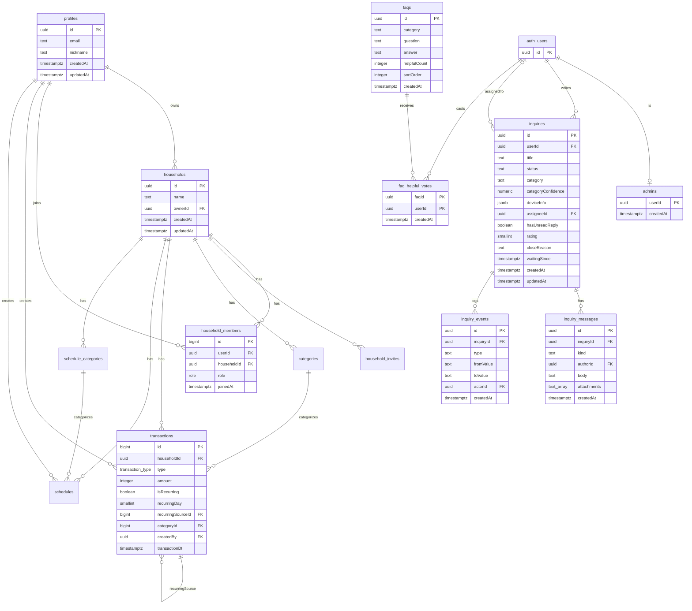

# 아키텍처

`moa-web`의 구조·데이터 모델·규약. 제품 요구사항은 [PRD.md](./PRD.md), 인증 흐름은 [authOnboarding.md](./authOnboarding.md), 알려진 개선 과제는 [improvements.md](./improvements.md)를 참고한다.

## 기술 스택

| 영역          | 선택                                                                         | 비고                                                                                                                                                                               |
| ------------- | ---------------------------------------------------------------------------- | ---------------------------------------------------------------------------------------------------------------------------------------------------------------------------------- |
| 프레임워크    | Next.js 16 (App Router) + React 19 + TypeScript 5.9                          | `pages/`는 App Router 이전 관례가 아니라 FSD `src/pages` 레이어와 이름이 겹치지 않도록 남겨둔 빈 디렉터리(README만 존재)                                                           |
| 개발 서버     | `next dev --turbopack`                                                       |                                                                                                                                                                                    |
| 프로덕션 빌드 | `next build --webpack`                                                       | `@ducanh2912/next-pwa`가 webpack 기반이라 빌드만 webpack 사용. **dev(turbopack)와 build(webpack)의 번들러가 다르다** — PWA 관련 프로덕션 전용 문제가 dev에서 재현되지 않을 수 있다 |
| 스타일        | CSS Modules(`*.module.css`) + `src/shared/styles/globals.css`의 CSS 변수     | Tailwind 미사용                                                                                                                                                                    |
| 상태 관리     | Zustand 5(클라이언트) + TanStack Query 5(서버)                               |                                                                                                                                                                                    |
| 차트          | ECharts 6 (`echarts/core` + 필요 모듈만 등록) + `echarts-for-react/lib/core` | 화면마다 별도 등록 모듈 사용(아래 참고)                                                                                                                                            |
| 백엔드/인증   | Supabase (`@supabase/ssr`, `@supabase/supabase-js`)                          |                                                                                                                                                                                    |
| PWA           | `@ducanh2912/next-pwa`                                                       |                                                                                                                                                                                    |
| 패키지 매니저 | pnpm                                                                         |                                                                                                                                                                                    |
| 스키마 검증   | 미도입 (zod 없음)                                                            | Supabase 응답도 타입 생성 없이 수동 타입 단언 — [improvements.md](./improvements.md)                                                                                               |
| 테스트        | Vitest 5 + `@testing-library/react`/`jest-dom`, 환경 `jsdom`                 | 순수 함수·훅·컴포넌트 테스트 다수 존재. GitHub Actions CI(`lint`/`format:check`/`typecheck`/`test`/`build`)로 검증                                                                 |

## FSD 레이어 구조

```
app → pages → widgets → features → entities → shared
```

상위 레이어만 하위 레이어를 import한다. 역방향·동일 레이어 간 직접 참조는 금지된다. 이 규칙은 현재 **린트로 강제되지 않고**(`eslint-plugin-boundaries` 미설치) 컨벤션으로만 지켜지고 있으며, 실측 결과 역방향·동일 레이어 위반은 0건이다.

| 레이어         | 역할                                                                                            |
| -------------- | ----------------------------------------------------------------------------------------------- |
| `app/`         | Next.js 라우트. 대부분 `src/pages`의 컴포넌트를 얇게 재수출하고 `metadata`만 선언               |
| `src/app`      | FSD의 app 레이어. `providers`(QueryClientProvider 등), `api-routes`(Route Handler 구현체)       |
| `src/pages`    | 화면 단위 슬라이스 (20개)                                                                       |
| `src/widgets`  | 여러 화면에 걸치는 조립 단위 (4개: `adminShell`, `appShell`, `attachmentGallery`, `siteFooter`) |
| `src/features` | 재사용 가능한 비즈니스 기능 — 주로 TanStack Query 훅 (13개)                                     |
| `src/entities` | 도메인 모델 + Supabase API 함수 (12개)                                                          |
| `src/shared`   | 도메인 무관 범용 코드 — `api`/`config`/`lib`/`model`/`styles`/`ui`                              |

### 슬라이스 목록

| 레이어   | 슬라이스                                                                                                                                                                                                                                                                   |
| -------- | -------------------------------------------------------------------------------------------------------------------------------------------------------------------------------------------------------------------------------------------------------------------------- |
| entities | admin, auth, category, faq, household, householdInvite, householdMember, inquiry, profile, schedule, scheduleCategory, transaction                                                                                                                                         |
| features | adminInquiry, auth, category, faq, household, householdMember, inquiry, onboarding, profile, pwaInstall, schedule, scheduleCategory, transaction                                                                                                                           |
| widgets  | adminShell, appShell, attachmentGallery, siteFooter                                                                                                                                                                                                                        |
| pages    | acceptInvite, adminInquiries, adminInquiryDetail, calendar, createHousehold, createProfile, errorFallback, guide, history, home, inquiryDetail, inquiryDone, inquiryWrite, legal, login, myInquiries, settings, support, welcome, write (+ 중첩 서브슬라이스 `write/edit`) |

#### 문의 도메인 슬라이스와 `shared/model`의 예외

1:1 문의는 사용자 쪽(`entities/inquiry`, `features/inquiry`)과 운영자 쪽(`entities/admin`, `features/adminInquiry`)을 슬라이스로 나눈다. 운영자 화면은 사용자 화면과 읽는 RPC·권한이 다르기 때문이다. `widgets/attachmentGallery`(사진 썸네일·확대 보기)는 두 쪽 화면이 함께 쓴다.

문의 카테고리·상태 enum(`InquiryCategory`/`InquiryStatus`와 `INQUIRY_CATEGORIES`/`INQUIRY_STATUSES`)은 도메인 지식이지만 [`src/shared/model/inquiryTaxonomy.ts`](../src/shared/model/inquiryTaxonomy.ts)에 둔다. `entities/admin`과 `entities/inquiry`는 같은 레이어라 서로를 import할 수 없는데 둘 다 이 enum이 필요하기 때문에 둔 의도적 예외이며, `shared`의 "도메인 무관" 원칙에서 벗어나는 유일한 문의 관련 코드다. `entities/inquiry`는 이를 재수출하고 라벨(`INQUIRY_CATEGORY_LABELS`, `getUserStatusLabel`/`getAdminStatusLabel`)을 덧붙인다.

### Public API 규칙

슬라이스 외부에서는 반드시 슬라이스 루트 `index.ts`(또는 `index.tsx`)를 통해 import한다. 내부 파일(`ui/`, `model/` 등)을 직접 import하지 않는다. 테스트 파일은 같은 슬라이스 내부를 상대 경로로 직접 import할 수 있는 예외를 갖는다.

세 가지 예외적 진입점이 실제로 쓰이고 있으며, 서버 전용 코드를 클라이언트 번들에서 분리하려는 의도된 설계다.

- [`src/shared/api/server.ts`](../src/shared/api/server.ts) — `createServerClient`·`getSupabaseJwks`·`classifyWithJev`(Jev 분류 호출, 비밀 키 사용)를 재수출. `index.ts`(브라우저 전용)와 분리
- [`src/features/onboarding/server.ts`](../src/features/onboarding/server.ts) — `resolveAuthGate`/`redirectForAuthGate`. `index.ts`(클라이언트용)와 분리
- [`src/entities/admin/server.ts`](../src/entities/admin/server.ts) — `requireAdmin`(운영자 아니면 `notFound()`). `next/navigation`·서버 클라이언트를 쓰므로 `index.ts`와 분리

그 밖에 `@/shared/lib/echarts`(홈 대시보드용 ECharts 등록 모듈, 번들 분리 목적), `@/pages/write/edit`(중첩 서브슬라이스) 등 소수의 deep import가 있다. 상세 목록과 개선 방향은 [improvements.md](./improvements.md)에 정리돼 있다.

#### pages 레이어의 `index` 관례에 대한 참고

`.claude/rules/pages-design.md`는 "`index.ts`는 `ui/{Domain}Page`를 re-export만 한다"고 규정하지만, 실제로는 조사 당시 13개 슬라이스 중 6개(`acceptInvite`/`createHousehold`/`createProfile`/`errorFallback`/`guide`/`legal`)만 이 규칙을 따르고 나머지 8개는 `index.tsx`에 페이지 구현체를 직접 담고 있다(`calendar`/`history`/`home`/`login`/`settings`/`welcome`/`write`/`write/edit`). 이후 추가된 문의 관련 7개 슬라이스(`support`/`inquiryWrite`/`inquiryDone`/`myInquiries`/`inquiryDetail`/`adminInquiries`/`adminInquiryDetail`)는 모두 `index.tsx` 방식이다. 서버 라우트가 파서(`parseWriteMode`/`parseStatusParam`)를 호출하는 슬라이스는 `index.tsx`에 `'use client'`를 두지 않고 `ui/`의 컴포넌트가 클라이언트 경계를 갖는다. 두 방식이 혼재하므로 새 슬라이스를 추가할 때는 팀에서 어느 쪽을 정본으로 삼을지 먼저 확인한다 — 자세한 근거는 [improvements.md](./improvements.md).

## 표준 데이터 흐름

entities → features로 이어지는 계층은 이 프로젝트에서 가장 일관되게 지켜지는 패턴이다.

```
entities/{domain}/config/tableName.ts     TABLE_NAME 상수 (Supabase 테이블명)
entities/{domain}/model/*.ts              Req/Res 타입 정의
entities/{domain}/api/{verb}{Entity}.ts   (supabase: SupabaseClient, payload) => Promise<Res>
                                           실패 시 Supabase 에러를 그대로 throw

features/{domain}/config/queryKeys.ts     queryKey 팩토리
features/{domain}/model/use*.ts           'use client' — useQuery/useMutation 훅
```

`supabase` 클라이언트 인스턴스를 **인자로 주입**받는 방식이라, 같은 entity 함수를 브라우저와 서버 양쪽에서 재사용할 수 있다. 예를 들어 [`resolveAuthGate`](../src/features/onboarding/model/resolveAuthGate.ts)는 서버 컴포넌트에서 `getProfile`/`listHouseholdMembersByUserId`를 직접 호출한다.

## 라우트 맵

### Route Group

| 그룹          | 용도                     | 인증 가드                                                                    |
| ------------- | ------------------------ | ---------------------------------------------------------------------------- |
| `(app)`       | 로그인 후 앱 화면        | `proxy.ts`(미들웨어)만. 페이지 자체의 서버 측 검증은 없음                    |
| `(auth)`      | 로그인·온보딩·초대       | 각 페이지가 서버에서 `resolveAuthGate()` 직접 호출                           |
| `(marketing)` | 공개 마케팅 페이지       | 없음(공개)                                                                   |
| `admin`       | 운영자 전용(그룹 아님)   | `proxy.ts`(로그인) + 레이아웃의 `requireAdmin()`(운영자만, 아니면 404)       |
| 없음(루트)    | Route Handler, 전역 파일 | `/auth/*`는 pass-through. `/api/*`는 proxy matcher 밖이라 핸들러가 직접 인증 |

### URL → 페이지 슬라이스

| URL                                | 라우트 파일                                      | 페이지 슬라이스                        |
| ---------------------------------- | ------------------------------------------------ | -------------------------------------- |
| `/`                                | `app/(app)/page.tsx`                             | `home`                                 |
| `/history`                         | `app/(app)/history/page.tsx`                     | `history`                              |
| `/calendar`                        | `app/(app)/calendar/page.tsx`                    | `calendar`                             |
| `/settings`                        | `app/(app)/settings/page.tsx`                    | `settings`                             |
| `/write`, `/write/[transactionId]` | `app/(app)/write/**`                             | `write`, `write/edit`                  |
| `/stats`                           | `app/(app)/stats/page.tsx`                       | 없음 — `redirect('/history')` 스텁     |
| `/login`                           | `app/(auth)/login/page.tsx`                      | `login`                                |
| `/onboarding/profile`              | `app/(auth)/onboarding/profile/page.tsx`         | `createProfile`                        |
| `/onboarding/household`            | `app/(auth)/onboarding/household/page.tsx`       | `createHousehold`                      |
| `/invite/[token]`                  | `app/(auth)/invite/[token]/page.tsx`             | `acceptInvite`                         |
| `/welcome`                         | `app/(marketing)/welcome/page.tsx`               | `welcome`                              |
| `/guide`, `/guide/[slug]`          | `app/(marketing)/guide/**`                       | `guide`                                |
| `/privacy`, `/terms`               | `app/(marketing)/*/page.tsx`                     | `legal`                                |
| `/auth/callback`                   | `app/auth/callback/route.ts`                     | OAuth 콜백 (Route Handler)             |
| `/support`                         | `app/(app)/support/page.tsx`                     | `support`                              |
| `/support/inquiries`               | `app/(app)/support/inquiries/page.tsx`           | `myInquiries` (`?status=`)             |
| `/support/inquiries/new`           | `app/(app)/support/inquiries/new/page.tsx`       | `inquiryWrite` (`?followUp=`/`?edit=`) |
| `/support/inquiries/[id]`          | `app/(app)/support/inquiries/[id]/page.tsx`      | `inquiryDetail`                        |
| `/support/inquiries/[id]/done`     | `app/(app)/support/inquiries/[id]/done/page.tsx` | `inquiryDone`                          |
| `/api/inquiries/classify`          | `app/api/inquiries/classify/route.ts`            | 문의 AI 분류 (Route Handler, POST)     |
| `/auth/complete`                   | `app/auth/complete/route.ts`                     | 온보딩 게이트 판별 (Route Handler)     |
| `/admin`                           | `app/admin/page.tsx`                             | `/admin/inquiries` 로 redirect         |
| `/admin/inquiries`                 | `app/admin/inquiries/page.tsx`                   | `adminInquiries` (필터는 URL 쿼리)     |
| `/admin/inquiries/[id]`            | `app/admin/inquiries/[id]/page.tsx`              | `adminInquiryDetail` (`?peek=1`)       |

`/support/inquiries/[id]`, `/support/inquiries/[id]/done`, `/admin/inquiries/[id]`는 `id`가 uuid가 아니면 `notFound()`다. `/support/**`는 `(app)` 그룹이라 `AppShell`을 쓰고 FAB은 `/write`·`/support/**`에서 숨긴다.

`app/admin/`은 `(app)` 그룹 밖이라 `AppShell`(탭바·FAB)이 없고 `widgets/adminShell`(어두운 사이드바, 좁은 화면에서는 상단 바)을 쓴다. 레이아웃 서버 컴포넌트가 `@/entities/admin/server`의 `requireAdmin()`(`is_admin` RPC)으로 운영자만 통과시키고, 아니거나 확인에 실패하면 `notFound()`다. `/admin`, `/support`는 `app/robots.ts`에서 disallow하고 `(app)`·`admin` 레이아웃 metadata도 noindex다. 어드민 쿼리(`['admin', ...]`)는 다른 사용자의 데이터를 담고 있어 `shouldDehydrateQuery`가 localStorage 영속화에서 제외한다. 운영자도 온보딩(프로필·가계부)을 마쳐야 `moa_gate`가 생겨 `/admin`에 들어올 수 있다. `?peek=1`은 이전 문의를 담당자 지정 없이 훑어보는 미리보기 모드다.

### 앱 네비게이션

하단 탭/사이드바 4개(홈·내역·달력·설정, [`src/shared/config/navItems.ts`](../src/shared/config/navItems.ts)) — 상세는 [PRD.md의 FR-NAV](./PRD.md#fr-nav--앱-네비게이션).

### 에러·로딩 경계 (현재 상태)

| 파일                   | 범위                              |
| ---------------------- | --------------------------------- |
| `app/global-error.tsx` | 전역 최후 방어선 (`'use client'`) |
| `app/(app)/error.tsx`  | `(app)` 그룹 전용                 |
| `app/not-found.tsx`    | 전역 404                          |

`(auth)`, `(marketing)` 그룹에는 세그먼트 전용 `error.tsx`가 없어 해당 그룹의 렌더 오류는 `global-error`(전체 페이지 교체)로 떨어진다. `loading.tsx`는 전 라우트에 걸쳐 존재하지 않으며, 로딩은 각 훅의 `isLoading` 분기로 처리한다 — [improvements.md](./improvements.md).

## 데이터 모델

Supabase Postgres. **테이블명 표기가 통일돼 있지 않다** — `households`/`profiles`/`transactions`/`categories`/`schedules`는 평범한 복수형이지만 `household-members`/`household-invites`/`schedule-categories`와 문의 쪽 `inquiry-messages`/`inquiry-events`/`faq-helpful-votes`는 하이픈이 들어간다(각 `entities/*/config/tableName.ts`와 마이그레이션에서 확인). `admins`/`faqs`/`inquiries`는 평범한 복수형이다. 컬럼명도 대부분 camelCase(`"householdId"`, `"transactionDt"`)인데 `categories.created_at`만 snake_case다.

### ER 다이어그램


```mermaid
erDiagram
  profiles ||--o{ households : owns
  profiles ||--o{ household_members : joins
  households ||--o{ household_members : has
  households ||--o{ household_invites : has
  households ||--o{ categories : has
  households ||--o{ transactions : has
  households ||--o{ schedules : has
  households ||--o{ schedule_categories : has
  categories ||--o{ transactions : categorizes
  schedule_categories ||--o{ schedules : categorizes
  transactions ||--o{ transactions : recurringSource
  profiles ||--o{ transactions : creates
  profiles ||--o{ schedules : creates
  auth_users ||--o| admins : is
  auth_users ||--o{ inquiries : writes
  auth_users |o--o{ inquiries : assignedTo
  inquiries ||--o{ inquiry_messages : has
  inquiries ||--o{ inquiry_events : logs
  faqs ||--o{ faq_helpful_votes : receives
  auth_users ||--o{ faq_helpful_votes : casts

  profiles {
    uuid id PK
    text email
    text nickname
    timestamptz createdAt
    timestamptz updatedAt
  }

  households {
    uuid id PK
    text name
    uuid ownerId FK
    timestamptz createdAt
    timestamptz updatedAt
  }

  household_members {
    bigint id PK
    uuid userId FK
    uuid householdId FK
    role role
    timestamptz joinedAt
  }

  transactions {
    bigint id PK
    uuid householdId FK
    transaction_type type
    integer amount
    boolean isRecurring
    smallint recurringDay
    bigint recurringSourceId FK
    bigint categoryId FK
    uuid createdBy FK
    timestamptz transactionDt
  }

  auth_users {
    uuid id PK
  }

  admins {
    uuid userId PK
    timestamptz createdAt
  }

  faqs {
    uuid id PK
    text category
    text question
    text answer
    integer helpfulCount
    integer sortOrder
    timestamptz createdAt
  }

  faq_helpful_votes {
    uuid faqId PK
    uuid userId PK
    timestamptz createdAt
  }

  inquiries {
    uuid id PK
    uuid userId FK
    text title
    text status
    text category
    numeric categoryConfidence
    jsonb deviceInfo
    uuid assigneeId FK
    boolean hasUnreadReply
    smallint rating
    text closeReason
    timestamptz waitingSince
    timestamptz createdAt
    timestamptz updatedAt
  }

  inquiry_messages {
    uuid id PK
    uuid inquiryId FK
    text kind
    uuid authorId FK
    text body
    text_array attachments
    timestamptz createdAt
  }

  inquiry_events {
    uuid id PK
    uuid inquiryId FK
    text type
    text fromValue
    text toValue
    uuid actorId FK
    timestamptz createdAt
  }
```

> 다이어그램의 `household_members`/`household_invites`/`schedule_categories`/`faq_helpful_votes`/`inquiry_messages`/`inquiry_events`는 가독성을 위한 표기이며, 실제 Postgres 테이블명은 위에서 설명한 대로 하이픈(`household-members` 등)이다. `auth_users`는 Supabase의 `auth.users`이고, `inquiries.userId`·`assigneeId`와 `admins.userId` 등 문의 쪽 사용자 참조는 `profiles`가 아니라 `auth.users`를 가리킨다. `text_array`는 `text[]`다.

### 테이블 필드

#### profiles

[`src/entities/profile/model/profile.ts`](../src/entities/profile/model/profile.ts)

| 필드        | 타입     |
| ----------- | -------- |
| `id`        | `string` |
| `email`     | `string` |
| `nickname`  | `string` |
| `createdAt` | `string` |
| `updatedAt` | `string` |

#### households

[`src/entities/household/model/household.ts`](../src/entities/household/model/household.ts)

| 필드        | 타입     |
| ----------- | -------- |
| `id`        | `string` |
| `name`      | `string` |
| `ownerId`   | `string` |
| `createdAt` | `string` |
| `updatedAt` | `string` |

#### household-members

테이블명: `household-members` — [`src/entities/householdMember/model/householdMember.ts`](../src/entities/householdMember/model/householdMember.ts)

| 필드          | 타입            |
| ------------- | --------------- |
| `id`          | `number`        |
| `userId`      | `string`        |
| `householdId` | `string`        |
| `role`        | `HouseholdRole` |
| `joinedAt`    | `string`        |

#### household-invites

테이블명: `household-invites` — [`src/entities/householdInvite/model/householdInvite.ts`](../src/entities/householdInvite/model/householdInvite.ts)

| 필드          | 타입                    |
| ------------- | ----------------------- |
| `id`          | `string`                |
| `householdId` | `string`                |
| `email`       | `string`                |
| `token`       | `string`                |
| `invitedBy`   | `string`                |
| `status`      | `HouseholdInviteStatus` |
| `createdAt`   | `string`                |
| `acceptedAt`  | `string \| null`        |

#### categories

| 필드          | 타입                                  |
| ------------- | ------------------------------------- |
| `id`          | `number`                              |
| `householdId` | `string`                              |
| `name`        | `string`                              |
| `type`        | `TransactionType`                     |
| `budget`      | `number \| null`                      |
| `created_at`  | `string` — **이 테이블만 snake_case** |

#### transactions

[`src/entities/transaction/model/transaction.ts`](../src/entities/transaction/model/transaction.ts)

| 필드                | 타입              |
| ------------------- | ----------------- |
| `id`                | `number`          |
| `householdId`       | `string`          |
| `type`              | `TransactionType` |
| `name`              | `string \| null`  |
| `amount`            | `number`          |
| `isRecurring`       | `boolean \| null` |
| `recurringDay`      | `number \| null`  |
| `recurringSourceId` | `number \| null`  |
| `categoryId`        | `number \| null`  |
| `memo`              | `string \| null`  |
| `createdBy`         | `string`          |
| `createdDt`         | `string`          |
| `updatedDt`         | `string`          |
| `transactionDt`     | `string`          |

#### schedules

| 필드          | 타입             |
| ------------- | ---------------- |
| `id`          | `number`         |
| `householdId` | `string`         |
| `title`       | `string`         |
| `memo`        | `string \| null` |
| `startAt`     | `string`         |
| `endAt`       | `string`         |
| `categoryId`  | `number \| null` |
| `createdBy`   | `string`         |
| `createdDt`   | `string`         |
| `updatedDt`   | `string`         |

#### schedule-categories

테이블명: `schedule-categories`

| 필드          | 타입     |
| ------------- | -------- |
| `id`          | `number` |
| `householdId` | `string` |
| `name`        | `string` |
| `color`       | `string` |
| `createdDt`   | `string` |

#### admins

운영자 목록. 마이그레이션 [`20261001000000_create_inquiry_tables.sql`](../supabase/migrations/20261001000000_create_inquiry_tables.sql)이 만들고, 등록은 SQL로 직접 한다(`INSERT INTO admins ("userId") VALUES ('<auth.users.id>')`). 앱에는 등록 화면이 없다.

| 필드        | 타입     | 비고                                     |
| ----------- | -------- | ---------------------------------------- |
| `userId`    | `string` | PK, `auth.users(id)` FK, 삭제 시 cascade |
| `createdAt` | `string` |                                          |

#### faqs

[`src/entities/faq/model/faq.ts`](../src/entities/faq/model/faq.ts). 초기 데이터 10건은 [`20261001000300_seed_faqs.sql`](../supabase/migrations/20261001000300_seed_faqs.sql)이 넣는다.

| 필드           | 타입     | 비고                                                     |
| -------------- | -------- | -------------------------------------------------------- |
| `id`           | `string` | uuid PK                                                  |
| `category`     | `string` | `InquiryCategory` 7개 중 하나 (CHECK)                    |
| `question`     | `string` |                                                          |
| `answer`       | `string` |                                                          |
| `helpfulCount` | `number` | 0 이상. `increment_faq_helpful` RPC로만 증가             |
| `sortOrder`    | `number` | 목록은 `helpfulCount` 내림차순 다음 `sortOrder` 오름차순 |
| `createdAt`    | `string` |                                                          |

#### faq-helpful-votes

테이블명: `faq-helpful-votes`. RPC 전용(`authenticated`에 직접 권한 없음)이며 `("faqId", "userId")` 복합 PK로 사용자당 FAQ 1회 집계를 보장한다.

| 필드        | 타입     | 비고                                  |
| ----------- | -------- | ------------------------------------- |
| `faqId`     | `string` | `faqs(id)` FK, cascade, PK 일부       |
| `userId`    | `string` | `auth.users(id)` FK, cascade, PK 일부 |
| `createdAt` | `string` |                                       |

#### inquiries

[`src/entities/inquiry/model/inquiry.ts`](../src/entities/inquiry/model/inquiry.ts)(사용자 조회용 11개 컬럼)와 [`src/entities/admin/model/adminInquiry.ts`](../src/entities/admin/model/adminInquiry.ts)(어드민 RPC 반환). 질문 본문은 첫 `inquiry-messages`(`kind='question'`)에 있다.

| 필드                 | 타입                      | 비고                                                                                       |
| -------------------- | ------------------------- | ------------------------------------------------------------------------------------------ |
| `id`                 | `string`                  | uuid PK                                                                                    |
| `userId`             | `string`                  | 작성자. `auth.users(id)` FK, cascade                                                       |
| `title`              | `string`                  | 2–50자 (CHECK)                                                                             |
| `status`             | `InquiryStatus`           | 기본 `waiting`                                                                             |
| `category`           | `InquiryCategory \| null` | `null` = 미분류                                                                            |
| `categoryConfidence` | `number \| null`          | 0–1. 카테고리가 있을 때만 저장. **사용자 직접 SELECT 불가**                                |
| `deviceInfo`         | `DeviceInfo \| null`      | jsonb 객체, RPC가 4096바이트 초과를 거절                                                   |
| `assigneeId`         | `string \| null`          | 담당 운영자, `auth.users(id)` FK, 삭제 시 `NULL`. **사용자 직접 SELECT 불가**              |
| `hasUnreadReply`     | `boolean`                 | 사용자가 읽지 않은 운영자 답변이 있는지                                                    |
| `rating`             | `number \| null`          | 1–5, 문의당 1회                                                                            |
| `closeReason`        | `string \| null`          | 운영자 종결 사유. **사용자 직접 SELECT 불가**                                              |
| `waitingSince`       | `string`                  | 대기 시작 시각. 접수·추가 문의·답변 완료를 대기로 되돌릴 때 갱신. 대기 시간·큐 정렬의 기준 |
| `createdAt`          | `string`                  |                                                                                            |
| `updatedAt`          | `string`                  | 변경 RPC가 갱신. 답변 충돌 검사의 기준                                                     |

#### inquiry-messages

테이블명: `inquiry-messages` — [`src/entities/inquiry/model/inquiryMessage.ts`](../src/entities/inquiry/model/inquiryMessage.ts), 어드민은 [`adminInquiryMessage.ts`](../src/entities/admin/model/adminInquiryMessage.ts)

| 필드          | 타입                              | 비고                                                        |
| ------------- | --------------------------------- | ----------------------------------------------------------- |
| `id`          | `string`                          | uuid PK                                                     |
| `inquiryId`   | `string`                          | `inquiries(id)` FK, cascade                                 |
| `kind`        | `'question' \| 'reply' \| 'memo'` | 사용자 질문·추가 문의 / 운영자 답변 / 운영자 내부 메모      |
| `authorId`    | `string \| null`                  | 작성자. 삭제 시 `NULL`. **사용자 직접 SELECT 불가**         |
| `body`        | `string`                          | 1–2000자 (CHECK). 사용자 질문의 10자 이상 규칙은 RPC가 검사 |
| `attachments` | `string[]`                        | Storage 경로, 최대 3개 (CHECK)                              |
| `createdAt`   | `string`                          |                                                             |

#### inquiry-events

테이블명: `inquiry-events`. 상태·담당자·카테고리 변경 이력이며 RPC 내부(`inquiry_log_event`)만 기록한다. 이를 보여주는 화면은 아직 없다.

| 필드        | 타입                                                        | 비고                          |
| ----------- | ----------------------------------------------------------- | ----------------------------- |
| `id`        | `string`                                                    | uuid PK                       |
| `inquiryId` | `string`                                                    | `inquiries(id)` FK, cascade   |
| `type`      | `'status_change' \| 'assignee_change' \| 'category_change'` |                               |
| `fromValue` | `string \| null`                                            | 변경 전 값(문자열)            |
| `toValue`   | `string \| null`                                            | 변경 후 값(문자열)            |
| `actorId`   | `string \| null`                                            | 변경한 사용자, 삭제 시 `NULL` |
| `createdAt` | `string`                                                    |                               |

#### inquiry-attachments (Storage 버킷)

private 버킷, 장당 10MB, 허용 MIME `image/jpeg`·`image/png`·`image/webp`·`image/heic`·`image/heif`. 경로는 `{userId}/{folderId}/{uuid}.{ext}`이며 `folderId`는 문의 id가 아니라 클라이언트가 만든 uuid다(문의 id는 접수 RPC가 만들기 때문). 운영자가 올리는 답변 첨부도 **문의 작성자의 `userId` 폴더**를 쓴다. 조회는 [`getAttachmentUrls`](../src/entities/inquiry/api/getAttachmentUrls.ts)가 만드는 서명 URL(수명 1시간)로 한다.

### 문의 RPC·권한 모델

문의의 모든 쓰기는 `SECURITY DEFINER` + `SET search_path = public` RPC로만 한다. 사용자 식별은 `auth.uid()`뿐이며 클라이언트가 보낸 사용자 id는 믿지 않는다. 오류는 `RAISE EXCEPTION '<코드>'`로 던져 `error.message`가 코드가 된다. 마이그레이션: [`20261001000100_add_inquiry_rls_and_storage.sql`](../supabase/migrations/20261001000100_add_inquiry_rls_and_storage.sql)(RLS·권한·버킷), [`20261001000200_add_inquiry_functions.sql`](../supabase/migrations/20261001000200_add_inquiry_functions.sql)(사용자·어드민 쓰기 RPC), [`20261002000000_add_admin_inquiry_read_functions.sql`](../supabase/migrations/20261002000000_add_admin_inquiry_read_functions.sql)(어드민 조회 RPC). 모든 함수는 `PUBLIC`/`anon` 실행 권한을 회수하고 `authenticated`/`service_role`에만 부여하며, 운영자 여부는 각 함수가 `is_admin()`으로 검사한다. 제목·본문·사유는 앞뒤 공백·탭·CR·LF만 제거한 뒤 길이를 센다(클라이언트 `validateInquiryForm`과 같은 기준).

`is_admin()`은 `admins`에 `auth.uid()`가 있는지 보는 `STABLE SECURITY DEFINER` 함수이며 앱은 [`getIsAdmin`](../src/entities/admin/api/getIsAdmin.ts)으로 호출한다. 내부 헬퍼 `inquiry_normalize_attachments`(경로 최대 3개, `..` 금지, 소유자 폴더 접두사 검사)와 `inquiry_log_event`는 `service_role`에만 실행 권한이 있다.

#### 사용자 RPC

| RPC                                                                                       | 목적                                                                           | 오류 코드                                                                                                                               |
| ----------------------------------------------------------------------------------------- | ------------------------------------------------------------------------------ | --------------------------------------------------------------------------------------------------------------------------------------- |
| `create_inquiry(p_title, p_body, p_category, p_confidence, p_device_info, p_attachments)` | 문의 + 첫 질문 메시지 생성. 카테고리가 없으면 신뢰도를 버린다. 새 문의 id 반환 | `unauthorized`, `invalid_title`, `invalid_body`, `invalid_category`, `invalid_confidence`, `invalid_device_info`, `invalid_attachments` |
| `update_inquiry(p_inquiry_id, p_title, p_body)`                                           | `waiting`이고 `reply`가 없을 때 제목·첫 질문 수정, `updatedAt` 갱신            | `unauthorized`, `invalid_title`, `invalid_body`, `not_found`, `invalid_state`                                                           |
| `add_inquiry_follow_up(p_inquiry_id, p_body, p_attachments)`                              | `answered` → `waiting`, `waitingSince` 갱신, 읽지 않음 해제, 질문 메시지 추가  | `unauthorized`, `invalid_body`, `invalid_attachments`, `not_found`, `invalid_state`                                                     |
| `close_inquiry(p_inquiry_id)`                                                             | 사용자 종결(해결됐어요): `answered` → `closed`                                 | `unauthorized`, `not_found`, `invalid_state`                                                                                            |
| `rate_inquiry(p_inquiry_id, p_rating)`                                                    | 별점 1–5, 1회. `answered`/`closed`이고 `reply`가 있어야 함                     | `unauthorized`, `invalid_rating`, `not_found`, `invalid_state`, `already_rated`                                                         |
| `mark_inquiry_read(p_inquiry_id)`                                                         | `hasUnreadReply`를 끈다. 본인 문의가 아니면 아무 일도 하지 않음                | `unauthorized`                                                                                                                          |
| `increment_faq_helpful(p_faq_id)`                                                         | `faq-helpful-votes`에 투표를 넣고, 처음일 때만 `helpfulCount` +1               | `unauthorized`, `not_found`                                                                                                             |

RPC가 아닌 접근은 둘이다. 내 문의·메시지 조회는 테이블 직접 SELECT(허용 컬럼을 명시, [`columns.ts`](../src/entities/inquiry/config/columns.ts))이고, 문의 삭제는 `DELETE`(RLS가 본인 행만 허용, 상태 제한 없음, 메시지는 cascade)다.

#### 어드민 쓰기 RPC

| RPC                                                                                                           | 목적                                                                                                                          | 오류 코드                                                                                                                             |
| ------------------------------------------------------------------------------------------------------------- | ----------------------------------------------------------------------------------------------------------------------------- | ------------------------------------------------------------------------------------------------------------------------------------- |
| `admin_open_inquiry(p_inquiry_id)`                                                                            | `waiting`이면 `in_progress`로 바꾸고 호출자를 담당자로 지정. 다른 상태면 아무것도 바꾸지 않음                                 | `unauthorized`, `forbidden`, `not_found`                                                                                              |
| `admin_reply_inquiry(p_inquiry_id, p_body, p_attachments, p_expected_last_message_id, p_expected_updated_at)` | 답변 등록 → `answered`, `hasUnreadReply=true`, 담당자가 없으면 호출자 지정. 첨부는 문의 작성자 폴더만 허용. 새 메시지 id 반환 | `unauthorized`, `forbidden`, `invalid_body`, `not_found`, `invalid_state`(종결됨), `uncategorized`, `invalid_attachments`, `conflict` |
| `admin_add_memo(p_inquiry_id, p_body)`                                                                        | 내부 메모 추가(사용자에게 안 보임)                                                                                            | `unauthorized`, `forbidden`, `invalid_body`, `not_found`                                                                              |
| `admin_update_inquiry_meta(p_inquiry_id, p_status, p_assignee_id, p_category)`                                | `NULL`은 변경 없음. 상태는 `waiting`/`in_progress`만, 담당자는 `admins`에 있어야 함. 변경 항목마다 `inquiry-events` 기록      | `unauthorized`, `forbidden`, `invalid_status`, `invalid_category`, `invalid_assignee`, `not_found`, `invalid_state`(종결됨)           |
| `admin_close_inquiry(p_inquiry_id, p_reason)`                                                                 | 운영자 종결. 사유 필수(1–500자, 오류 코드는 `invalid_body`), 담당자가 없으면 호출자 지정                                      | `unauthorized`, `forbidden`, `invalid_body`, `not_found`, `invalid_state`(이미 종결)                                                  |

`admin_reply_inquiry`의 `conflict`: 메모를 뺀 마지막 메시지 id가 `p_expected_last_message_id`와 다르거나, `p_expected_updated_at`이 없거나, 문의의 `updatedAt`이 그보다 나중이면 던진다. 사용자가 `update_inquiry`/`add_inquiry_follow_up`으로 문의를 바꾸면 `updatedAt`이 갱신돼 이 검사에 걸린다. 클라이언트는 [`getAdminErrorKind`](../src/entities/admin/lib/getAdminErrorKind.ts)로 메시지 속 코드를 화면 문구 종류로, [`isDefinitiveRejection`](../src/entities/inquiry/lib/isDefinitiveRejection.ts)으로 "서버가 확정 거절해 올린 첨부를 정리해도 되는지"를 판단한다.

#### 어드민 조회 RPC

모두 시작 시 `auth.uid()`/`is_admin()`을 검사하고(`unauthorized`/`forbidden`), 동적 SQL 없이 정렬은 `CASE` 화이트리스트로 처리하며, `auth.users`에서는 이메일만 읽는다. 반환 컬럼은 camelCase 따옴표 이름이다.

| RPC                                                                                                                             | 반환                                             | 쓰는 곳                                          | 추가 오류 코드   |
| ------------------------------------------------------------------------------------------------------------------------------- | ------------------------------------------------ | ------------------------------------------------ | ---------------- |
| `admin_list_inquiries(p_statuses, p_category, p_uncategorized_only, p_since, p_keyword, p_sort, p_sort_dir, p_limit, p_offset)` | 목록 행 + `totalCount`                           | `getAdminInquiries` (`/admin/inquiries`)         | `invalid_filter` |
| `admin_pending_inquiry_count()`                                                                                                 | `bigint` (대기 + 처리 중)                        | `getAdminPendingCount` (사이드바 배지)           |                  |
| `admin_get_inquiry(p_inquiry_id)`                                                                                               | 문의 상세 (+ 담당자 이메일)                      | `getAdminInquiry` (`/admin/inquiries/[id]`)      | `not_found`      |
| `admin_get_inquiry_messages(p_inquiry_id)`                                                                                      | 메시지(메모 포함, 작성자 이메일)                 | `getAdminInquiryMessages`                        | `not_found`      |
| `admin_list_admins()`                                                                                                           | 운영자 목록(이메일 오름차순)                     | `getAdminList` (담당자 드롭다운)                 |                  |
| `admin_user_recent_inquiries(p_inquiry_id, p_limit)`                                                                            | 같은 사용자의 다른 문의(최신순, 1–20건으로 보정) | `getAdminUserRecentInquiries` (상세 사이드 패널) | `not_found`      |

`admin_list_inquiries` 세부: `p_limit`은 1–100으로 보정(기본 20), 키워드는 trim 후 100자로 자르고 2자 미만이면 무시하며 제목 또는 모든 메시지(메모 포함) 본문을 `ILIKE` 부분 일치로 찾는다(`%`·`_`·`\`는 이스케이프). `p_sort='waiting'`은 큐 순서로, 방향과 관계없이 상태 그룹(`waiting` < `in_progress` < 그 외)을 먼저 오름차순으로 놓고 그룹 안에서 `waitingSince`를 `p_sort_dir`로 정렬한다. `confidence`는 `NULL`이 항상 마지막이다. `totalCount`는 페이지네이션 이전 전체 건수이며 `offset`이 범위를 넘으면 행이 없어 알 수 없다(클라이언트가 1쪽으로 되돌린다).

#### 컬럼 단위 SELECT 권한과 어드민 화면이 RPC로 읽는 이유

사용자와 운영자는 같은 Postgres 롤(`authenticated`)이라 컬럼 `GRANT`가 운영자에게도 똑같이 적용된다. 그래서 `inquiries`의 `closeReason`·`categoryConfidence`·`assigneeId`와 `inquiry-messages`의 `authorId`는 **어떤 로그인 사용자도 테이블에서 직접 읽을 수 없다**(`select('*')`는 permission denied이므로 클라이언트는 허용 컬럼을 명시한다). 운영자용 SELECT 정책을 따로 두면 일부 컬럼만 읽는 두 번째 경로가 생기므로 두지 않았고, 운영자 화면은 위 조회 RPC로만 읽는다.

#### RLS 요약

모든 문의 테이블에 RLS를 켜고 기본 권한을 모두 회수한 뒤 필요한 것만 부여한다. `authenticated`에는 INSERT/UPDATE 권한이 어디에도 없다.

| 대상                                      | 정책                                                             | 권한                                  |
| ----------------------------------------- | ---------------------------------------------------------------- | ------------------------------------- |
| `admins`                                  | 본인 행만 SELECT                                                 | SELECT                                |
| `faqs`                                    | 로그인 사용자 전체 SELECT                                        | SELECT                                |
| `inquiries`                               | 본인 행 SELECT·DELETE (운영자용 정책 없음)                       | SELECT(11개 컬럼, 위 3개 제외)·DELETE |
| `inquiry-messages`                        | 본인 문의의 `memo`가 아닌 메시지 SELECT (운영자용 정책 없음)     | SELECT(`authorId` 제외)               |
| `inquiry-events`                          | `is_admin()`인 사용자만 SELECT                                   | SELECT                                |
| `faq-helpful-votes`                       | 정책 없음, RPC 전용                                              | `authenticated` 권한 없음             |
| `storage.objects` (`inquiry-attachments`) | SELECT·INSERT·DELETE: 경로 첫 폴더가 본인 uid이거나 `is_admin()` | —                                     |

#### 상태 전이

모든 전이는 RPC가 `FOR UPDATE` 잠금 아래 검증한다. 종결(`closed`)된 문의는 어떤 전이도 일어나지 않는다(별점은 `closed`에서도 가능).

| 전이                                          | 주체   | RPC                                                          |
| --------------------------------------------- | ------ | ------------------------------------------------------------ |
| (없음) → `waiting`                            | 사용자 | `create_inquiry`                                             |
| `waiting` → `in_progress`                     | 운영자 | `admin_open_inquiry`, `admin_update_inquiry_meta`            |
| `in_progress` → `waiting`                     | 운영자 | `admin_update_inquiry_meta`                                  |
| `waiting`/`in_progress` → `answered`          | 운영자 | `admin_reply_inquiry`                                        |
| `answered` → `answered` (추가 답변)           | 운영자 | `admin_reply_inquiry` (상태 이벤트 없음)                     |
| `answered` → `waiting`/`in_progress`          | 운영자 | `admin_update_inquiry_meta` (`waiting`이면 대기 시간 재시작) |
| `answered` → `waiting`                        | 사용자 | `add_inquiry_follow_up` (추가 문의)                          |
| `answered` → `closed`                         | 사용자 | `close_inquiry`                                              |
| `waiting`/`in_progress`/`answered` → `closed` | 운영자 | `admin_close_inquiry` (사유 필수)                            |

### Jev 분류 연동

문의 카테고리 자동 분류는 외부 서비스 Jev를 서버에서만 호출한다.

- 호출 모듈: [`src/shared/api/jev/server.ts`](../src/shared/api/jev/server.ts)의 `classifyWithJev` — `shared/api/server.ts`로만 재수출되는 서버 전용 클라이언트라 브라우저 번들에 들어가지 않는다. `Authorization: Bearer` 키는 `JEV_API_KEY`에서 읽으며(없으면 호출 없이 `null`), 엔드포인트와 모델은 `JEV_API_URL`·`JEV_MODEL`(미설정이면 코드 기본값)이다. 환경 변수 이름만 문서화하고 값은 저장소에 두지 않는다.
- 타임아웃·폴백: 서버 호출 3초 타임아웃. 비정상 응답·타임아웃·네트워크 오류·형식 오류는 throw 없이 `null`이며, 사유 코드(`no_key`/`timeout`/`network`/`parse`/HTTP 상태)만 `console.warn`으로 남기고 키·URL·입력 텍스트·응답 본문은 남기지 않는다.
- Route Handler: `POST /api/inquiries/classify`([`src/app/api-routes/classifyInquiry.ts`](../src/app/api-routes/classifyInquiry.ts)). proxy matcher가 `/api`를 덮지 않으므로 핸들러가 `supabase.auth.getUser()`로 직접 인증한다(실패 `401`). 요청 본문 16KB 초과는 `413`, `{ text }`가 아니거나 trim 후 10자 미만·2051자 초과(제목 50 + 개행 + 내용 2000)면 `400 invalid_text`이며, 응답은 `Cache-Control: no-store`로 `{ category, confidence }`를 돌려준다.
- 결과 변환: [`mapJevCategory`](../src/entities/inquiry/lib/mapJevCategory.ts) — 신뢰도가 범위(0–1) 밖이거나 유한하지 않으면 둘 다 `null`, 알 수 없는 선택지이거나 임계값(`INQUIRY_CLASSIFY_THRESHOLD` 0.5) 미만이면 카테고리만 `null`(미분류). 분류 지시문·카테고리별 기준은 [`classifyCriteria.ts`](../src/entities/inquiry/config/classifyCriteria.ts)에 있다.
- 클라이언트: [`classifyInquiry`](../src/entities/inquiry/api/classifyInquiry.ts)는 어떤 실패든 미분류로 돌려주고 취소(`AbortError`)만 다시 던진다. 작성 중 예비 분류는 내용만 800ms 디바운스로, 접수 시 최종 분류는 `제목\n내용`을 5초 타임아웃으로 호출하며 실패해도 접수를 막지 않는다([`useSubmitInquiry`](../src/pages/inquiryWrite/model/useSubmitInquiry.ts)).

### 알려진 한계·후속 과제

- `admin_update_inquiry_meta`에는 서버 쪽 expected-updatedAt 검사가 없다. 답변(`admin_reply_inquiry`)과 달리 낡은 화면의 상태·담당자·카테고리 변경이 그대로 덮어쓰며, 현재는 클라이언트가 초안을 버리는 것으로 막는다.
- 고아 첨부 파일: DB cascade·행 삭제는 Storage 객체를 지우지 않는다. 문의 삭제와 업로드 후 실패·이탈은 클라이언트가 best-effort로만 정리하므로 서버 쪽 정리 배치가 필요하다.
- 첨부 열람 기록 없음: 운영자가 사진을 연 이력은 남지 않는다.
- 작업 로그 화면 없음: `inquiry-events`는 기록과 운영자 조회 정책만 있고 이를 읽는 화면·함수가 없다.
- 운영자 등록은 SQL 수동이며, 운영자도 일반 온보딩(프로필·가계부)을 마쳐야 어드민에 들어올 수 있다.
- Jev 외부 전송에 맞춘 개인정보처리방침 개정이 아직 없다(작성 화면 고지만 있음).

### 공통 enum

**TransactionType** — [`src/shared/model/transactionType.ts`](../src/shared/model/transactionType.ts): `income`(수입) · `expense`(지출) · `saving`(저축) · `insurance`(보험)

**HouseholdRole** — [`src/shared/model/householdRole.ts`](../src/shared/model/householdRole.ts): `owner`(소유자) · `member`(멤버)

**HouseholdInviteStatus** — [`src/entities/householdInvite/model/householdInviteStatus.ts`](../src/entities/householdInvite/model/householdInviteStatus.ts): `'pending' | 'accepted' | 'cancelled'`

**InquiryCategory** — [`src/shared/model/inquiryTaxonomy.ts`](../src/shared/model/inquiryTaxonomy.ts): `shared_household`(공유 가계부) · `record_category`(기록·카테고리) · `stats_screen`(통계·화면) · `account_login`(계정·로그인) · `bug_report`(오류 신고) · `feature_request`(기능 제안) · `other`(기타). 미분류는 enum 값이 아니라 `null`이다. DB는 `faqs`·`inquiries`의 CHECK 제약으로 같은 7개를 강제한다.

**InquiryStatus** — 같은 파일: `waiting`(답변 대기) · `in_progress`(처리 중) · `answered`(답변 완료) · `closed`(종결). 사용자 화면은 `in_progress`를 "답변 대기"로 표기한다([`inquiryStatus.ts`](../src/entities/inquiry/config/inquiryStatus.ts)).

**InquiryMessageKind** — `question` · `reply` · `memo` ([`inquiryMessage.ts`](../src/entities/inquiry/model/inquiryMessage.ts)). **문의 이벤트 type** — `status_change` · `assignee_change` · `category_change`(테이블 CHECK).

> **주의**: 가계부 도메인 스키마(`profiles`/`households`/`household-*`/`transactions`/`categories`/`schedules`/`schedule-categories`)는 애플리케이션 코드(`entities/*/model/*.ts`)로부터 역산한 것이다. `supabase/migrations/`에는 이 테이블들의 `CREATE TABLE`/RLS 정책이 존재하지 않아(반복 거래용 마이그레이션 3개뿐) 실제 프로덕션 스키마와 대조 검증할 수 없다. 이 자체가 [improvements.md](./improvements.md)의 최우선 항목이다. 반대로 1:1 문의 도메인(`admins`/`faqs`/`faq-helpful-votes`/`inquiries`/`inquiry-messages`/`inquiry-events`와 Storage 버킷)은 마이그레이션 5개가 단일 출처다.

## 상태 관리와 데이터 흐름

### 서버 상태 (TanStack Query)

`QueryClient` 기본 옵션은 [`src/shared/lib/queryClient.ts`](../src/shared/lib/queryClient.ts)에 `staleTime: 60_000`, `refetchOnWindowFocus: false`, `gcTime: 24h`다. `retry`/전역 에러 핸들러는 기본값을 그대로 쓴다 — 개선 여지는 [improvements.md](./improvements.md) 참고. 서버 prefetch/`HydrationBoundary`는 쓰지 않는다.

**캐시 영속화** — [`src/app/providers`](../src/app/providers/)가 `PersistQueryClientProvider`로 캐시를 `localStorage`(`moa:query-cache`)에 저장·복원한다. 설치형 PWA를 완전히 종료한 뒤 다시 열어도 마지막 대시보드를 네트워크 응답 전에 즉시 그리기 위한 것이다(PRD 비기능 요구사항 "콜드 스타트").

- persister: [`src/shared/lib/queryPersister.ts`](../src/shared/lib/queryPersister.ts) — `createSyncStoragePersister`(동기 localStorage, `retry: removeOldestQuery`로 용량 초과 시 오래된 쿼리부터 버리며 재시도). IndexedDB 비동기 복원은 첫 렌더가 복원을 기다려야 하고 데이터 크기(가계부 1년치 JSON 수백 KB)가 5MB 한도 안이라 동기 방식을 택했다. 상수(`moa:query-cache`, 24h, buster)는 [`src/shared/config/queryPersist.ts`](../src/shared/config/queryPersist.ts) — `queryClient.ts`가 persister 패키지를 import하지 않도록 분리했다.
- `maxAge` 24시간, `buster` `'v1'`(캐시 데이터 형태가 바뀔 때 수동으로 올린다 — 배포마다 비우지 않음). 전역 `gcTime`을 `maxAge`와 같게 둔다: 다른 화면에 머무는 동안 observer가 없는 대시보드 쿼리가 기본 5분 뒤 GC되면 영속 캐시에서도 빠져, 다음 콜드 스타트에 홈이 스켈레톤으로 시작하기 때문이다.
- 저장 대상: [`shouldDehydrateQuery`](../src/app/providers/shouldDehydrateQuery.ts) — `success` 상태이고 queryKey 루트가 `auth`·`admin`이 아니며 `['inquiries', 'attachmentUrls', ...]`도 아닌 쿼리만. 사용자 객체는 저장하지 않는다. `['admin', ...]`은 다른 사용자의 문의 제목·운영자 이메일이 담겨 있어, 첨부 서명 URL은 1시간 뒤 만료돼 다음 방문에 깨진 URL이 복원되므로 제외한다. 그 밖의 문의·FAQ 쿼리(`['inquiries', ...]`, `['faqs', ...]`)는 일반 쿼리처럼 저장된다.
- 삭제: 로그아웃(`useSignOut`)에서 `queryClient.clear()` 후 `persister.removeClient()`. 세션 만료로 proxy가 `/login`에 보내는 경로는 `useSignOut`을 거치지 않으므로, 로그인 페이지의 [`ResetClientState`](../src/pages/login/ui/ResetClientState.tsx)가 마운트 시 쿼리 캐시·영속 저장소·현재 가계부 id를 모두 비운다(`/login`은 미인증일 때만 도달하므로 항상 안전). 가계부 전환은 캐시 키가 householdId를 포함하므로 추가 조치가 없다. **알려진 한계**: 저장 키가 사용자와 무관하므로, 이전 계정 화면이 다른 브라우저 탭에 열린 채 남아 있으면 그 탭의 구독자가 `/login` 정리 직후 이전 캐시를 다시 쓸 수 있다(설치형 PWA는 단일 창이라 해당 없음). 필요해지면 키 또는 `buster`에 userId를 섞는다.
- 복원 중에는 쿼리가 `pending` + `fetchStatus: 'idle'`이라 `isLoading`이 false다. 로딩 판정은 `isPending`으로 해야 빈 데이터가 한 프레임 그려지지 않는다(`useCurrentHousehold`, `useHomeDashboard`).
- 캐시가 보이는 상태에서의 갱신 피드백(홈): `DashboardSection` 상단에 항상 마운트된 `role="status"` 영역(고정 높이 — 레이아웃 시프트 방지)에 갱신 중 "이전 데이터 · 업데이트 중…", 완료 후 3초간 "최신 정보로 업데이트되었습니다", 갱신 실패 시 본문을 유지한 채 "최신 정보를 가져오지 못했어요" + 다시 시도 버튼([`useRefreshStatus`](../src/pages/home/model/useRefreshStatus.ts)). 데이터가 없을 때만 전체 로딩/에러 문구로 대체한다.
  queryKey는 각 feature 슬라이스의 `config/queryKeys.ts` 팩토리로 관리한다(예: [`src/features/transaction/config/queryKeys.ts`](../src/features/transaction/config/queryKeys.ts)). `entities/config`에도 공유 queryKey를 둘 수 있다(예: [`src/entities/auth/config/queryKeys.ts`](../src/entities/auth/config/queryKeys.ts)).

**문의 쿼리 키·캐시 규칙**

| 팩토리                                                               | 키                                                                                                                   |
| -------------------------------------------------------------------- | -------------------------------------------------------------------------------------------------------------------- |
| [`inquiryQueryKeys`](../src/features/inquiry/config/queryKeys.ts)    | `['inquiries']` 아래 `list(status?)`, `detail(id)`, `messages(id)`, `unreadCount()`, `attachmentUrls(paths)`         |
| [`adminQueryKeys`](../src/features/adminInquiry/config/queryKeys.ts) | `['admin']` 아래 `inquiries(filters?)`, `pendingCount()`, `inquiry(id)`, `messages(id)`, `recent(id)`, `operators()` |
| [`faqQueryKeys`](../src/features/faq/config/queryKeys.ts)            | `['faqs', 'list', category \| 'all']`, `['faqs', 'search', keyword]`                                                 |

- 사용자 쪽: 읽음·삭제 mutation은 목록 캐시를 직접 고치고 `invalidateQueries`는 `refetchType: 'none'`으로 걸어, 정렬 기준(`hasUnreadReply`)이 바뀐 카드가 튀지 않게 한다. 삭제된 문의의 `detail`/`messages` 캐시는 구독자가 없어진 뒤에 제거한다(구독자가 있는 채로 지우면 삭제된 행을 다시 조회한다).
- 어드민 쪽: `useAdminInquiry`는 `refetchOnMount: 'always'`(열기·답변 충돌 검사의 기준이 낡은 캐시면 안 됨, 일시 오류만 1회 재시도), 목록은 `keepPreviousData`, 미처리 건수는 60초 `refetchInterval`, 운영자 목록은 `staleTime` 10분이다. 답변·메모·열기·메타 변경 뒤에는 상세·메시지·이전 문의·미처리 건수·목록을 함께 무효화한다. 필터의 단일 출처는 URL이며 쿼리 키에 필터 객체가 들어간다.
- 서명 URL 만료: URL 수명은 1시간인데 [`useAttachmentUrls`](../src/features/inquiry/model/useAttachmentUrls.ts)는 30분 뒤 stale, `gcTime` 50분으로 두고, 마운트된 동안 25분마다 다시 서명하며, 서명 후 55분이 지난 데이터는 없는 값(`data: undefined`)으로 취급해 로딩 상태를 보이게 한다. 개별 이미지가 로드에 실패하면 "사진을 불러오지 못했어요"를 보이고 URL이 바뀌면 실패 표시를 초기화한다([`AttachmentGallery`](../src/widgets/attachmentGallery/ui/AttachmentGallery.tsx)).

### 클라이언트 상태 (Zustand)

스토어는 [`currentHouseholdStore`](../src/features/household/model/currentHouseholdStore.ts) 하나뿐이다. `persist` 미들웨어 대신 `localStorage`(`moa:currentHouseholdId`)를 수동으로 읽고 쓰며, SSR hydration mismatch를 피하기 위한 `hydrated` 플래그를 직접 구현했다. 훅은 [`useCurrentHousehold`](../src/features/household/model/useCurrentHousehold.ts).

### 세션

Supabase httpOnly 쿠키(세션) + `moa_gate`(온보딩 완료 캐시). 상세는 [authOnboarding.md](./authOnboarding.md).

## 인증과 온보딩 (요약)

세션은 Supabase httpOnly 쿠키로 유지하고, 온보딩 완료 여부는 `moa_gate`(`ready:{userId}`) 쿠키로 캐시한다. 전체 상태 전이·리다이렉트 규칙·`proxy.ts` 분기 로직은 [authOnboarding.md](./authOnboarding.md)가 단일 출처다. `(app)` 그룹 페이지 자체에는 서버 측 인증 재검증이 없고 `proxy.ts` 미들웨어에만 의존한다는 점은 [improvements.md](./improvements.md)에 리스크로 기록돼 있다.

문의 기능이 더한 점:

- `proxy.ts` matcher에 `/support`, `/support/:path*`, `/admin`, `/admin/:path*`가 추가됐다. 이 경로는 일반 앱 경로로 취급돼 비로그인은 `/login`으로, 온보딩 미완료 사용자는 `/auth/complete?next=…`로 간다. 따라서 **온보딩 게이트는 운영자에게도 똑같이 적용**된다.
- 운영자 권한(`is_admin`)은 `proxy.ts`가 아니라 [`app/admin/layout.tsx`](../app/admin/layout.tsx)의 `requireAdmin()`(서버 컴포넌트, `is_admin` RPC)과 각 어드민 RPC가 이중으로 검사한다. 운영자가 아니거나 확인에 실패하면 `notFound()`(404)다. 실제 데이터 접근의 최종 방어선은 각 RPC의 `forbidden` 검사다.
- `/api/inquiries/classify`는 matcher 밖이라 Route Handler가 `supabase.auth.getUser()`로 직접 인증한다.
- `app/robots.ts`는 운영 환경에서 `/admin`, `/support`를 disallow하고, `(app)`·`admin` 레이아웃 metadata는 `noindex, nofollow`다.

## 반복 거래 인프라

반복 거래 관련 마이그레이션은 아래 3개다(문의 도메인 마이그레이션은 [문의 RPC·권한 모델](#문의-rpc권한-모델) 참고).

1. [`20260902150000_add_recurring_transaction_columns.sql`](../supabase/migrations/20260902150000_add_recurring_transaction_columns.sql) — `transactions`에 `recurringDay`(1~31 CHECK), `recurringSourceId`(self FK) 추가 + 월별 중복 방지 partial unique index
2. [`20260902150100_add_generate_recurring_transactions_function.sql`](../supabase/migrations/20260902150100_add_generate_recurring_transactions_function.sql) — `generate_recurring_transactions()` (`SECURITY DEFINER`, `search_path=public` 고정, PUBLIC REVOKE 후 postgres/service_role만 GRANT). 템플릿 생성 다음 달부터 이번 달(KST 기준)까지 순회하며, 그 달에 대응하는 자식 행이 없으면(`NOT EXISTS`) 말일 보정(`LEAST(recurringDay, 그 달의 말일)`)한 날짜로 사본을 INSERT
3. [`20260902150200_schedule_recurring_transactions_cron.sql`](../supabase/migrations/20260902150200_schedule_recurring_transactions_cron.sql) — `pg_cron`으로 매일 `05 15 * * *`(UTC) = KST 00:05 실행

이 배치의 알려진 결함(삭제한 사본이 재생성됨, 매일 전체 과거를 재순회함)은 [improvements.md](./improvements.md)의 최우선 항목이다.

## 빌드·배포·환경 변수

| 스크립트          | 명령                                                                               |
| ----------------- | ---------------------------------------------------------------------------------- |
| 개발              | `pnpm dev` (`next dev --turbopack`)                                                |
| 빌드              | `pnpm build` (`next build --webpack`)                                              |
| 프로덕션 실행     | `pnpm start`                                                                       |
| 린트              | `pnpm lint` (`eslint app src proxy.ts scripts next.config.ts`)                     |
| 포맷              | `pnpm format` / `pnpm format:check` (`app src proxy.ts scripts next.config.ts` 등) |
| 타입체크          | `pnpm typecheck` (`tsc --noEmit`)                                                  |
| 테스트            | `pnpm test` (`vitest run`) / `pnpm test:watch`                                     |
| OG 이미지 생성    | `pnpm og:generate`                                                                 |
| iOS 스플래시 생성 | `pnpm splash:generate` (아래 참고)                                                 |

**iOS 스플래시**: 해상도 목록은 [`src/shared/config/appleSplash.ts`](../src/shared/config/appleSplash.ts)가 단일 출처이고, `app/layout.tsx`의 `appleWebApp.startupImage`와 생성 스크립트가 모두 이 목록에서 파생된다. 새 iPhone·iPad가 나오면 `APPLE_SPLASH_SPECS`에 `{ width, height, deviceWidth, deviceHeight, ratio }`(width = deviceWidth × ratio)를 추가하고 `pnpm splash:generate`를 실행해 PNG를 커밋한다 — 테스트가 스펙과 `public/splash/`의 파일 목록이 정확히 일치하는지 검사하므로 누락·잔여 파일은 CI에서 걸린다. 매칭되는 `media`가 없으면 iOS는 흰 화면을 띄운다. 가로·다크 변형은 앱이 세로 전용 UI이고 다크 모드가 없어 만들지 않는다. 생성물은 `next.config.ts`의 `publicExcludes`로 SW 프리캐시에서 제외한다 — iOS가 시작 이미지를 OS 레벨에서 따로 캐시하므로 프리캐시하면 모든 방문자가 쓰지 않는 수 MB를 받게 된다.

환경 변수: `NEXT_PUBLIC_SUPABASE_URL`, `NEXT_PUBLIC_SUPABASE_PUBLISHABLE_KEY`(필수, [`src/shared/api/createBrowserClient.ts`](../src/shared/api/createBrowserClient.ts) 등에서 non-null 단언으로만 사용 — 런타임 검증 없음), `NEXT_PUBLIC_SITE_URL`(선택, [`src/shared/config/site.ts`](../src/shared/config/site.ts)에서 Vercel 환경변수로 폴백). 서버 전용(`NEXT_PUBLIC_` 금지): `JEV_API_KEY`(1:1 문의 AI 분류 API 키, 없으면 분류는 항상 미분류), `JEV_API_URL`(선택, 분류 API 엔드포인트), `JEV_MODEL`(선택, 분류 모델명). 호출은 [`src/shared/api/jev/server.ts`](../src/shared/api/jev/server.ts)에서만 하며 `POST /api/inquiries/classify` Route Handler가 로그인 확인 후 사용한다(`JEV_API_URL`·`JEV_MODEL`이 없으면 코드 기본값, 상세는 [Jev 분류 연동](#jev-분류-연동)). 클라이언트 쪽 선택 변수 `NEXT_PUBLIC_APP_VERSION`은 문의의 기기 정보 `appVersion`에 쓰이며 없으면 `unknown`이다.

CI는 [`.github/workflows/ci.yml`](../.github/workflows/ci.yml)에서 `pull_request`와 `main` push마다 `lint`/`format:check`/`typecheck`/`test`를 하나의 `verify` 잡으로, `pnpm build`를 별도 `build` 잡으로 병렬 실행한다(빌드는 dev의 turbopack과 다른 webpack 경로라 별도 검증이 필요). git hook(husky/lint-staged)은 없다. 브랜치·커밋·PR 규칙은 [`.claude/rules/git-workflow.md`](../.claude/rules/git-workflow.md).

`vitest.config.mts`는 `test.env.TZ`를 `Asia/Seoul`로 고정한다. 일부 순수 함수(`buildDailyExpenses`/`buildWeeklyExpenses`/`buildEventLanes`/`visibleRange` 등)는 로컬 타임존 기준으로 날짜 경계를 계산하는데, GitHub Actions 러너의 기본 TZ는 UTC라 고정하지 않으면 로컬에서 통과한 테스트가 CI에서만 깨질 수 있다.

## 주요 파일 빠른 참조

| 파일                                                                                                                | 역할                                                                        |
| ------------------------------------------------------------------------------------------------------------------- | --------------------------------------------------------------------------- |
| [`proxy.ts`](../proxy.ts)                                                                                           | 인증 미들웨어 (세션 + `moa_gate` 분기)                                      |
| [`src/shared/api/index.ts`](../src/shared/api/index.ts)                                                             | 브라우저용 Supabase 클라이언트 진입점                                       |
| [`src/shared/api/server.ts`](../src/shared/api/server.ts)                                                           | 서버용 Supabase 클라이언트 진입점                                           |
| [`src/shared/api/getSupabaseJwks.ts`](../src/shared/api/getSupabaseJwks.ts)                                         | proxy용 JWKS 모듈 캐시(10분)                                                |
| [`src/shared/lib/queryClient.ts`](../src/shared/lib/queryClient.ts)                                                 | TanStack Query 기본 설정                                                    |
| [`src/shared/styles/globals.css`](../src/shared/styles/globals.css)                                                 | 디자인 토큰(CSS 변수)                                                       |
| [`src/features/household/model/currentHouseholdStore.ts`](../src/features/household/model/currentHouseholdStore.ts) | 유일한 Zustand 스토어                                                       |
| [`src/features/onboarding/model/resolveAuthGate.ts`](../src/features/onboarding/model/resolveAuthGate.ts)           | 온보딩 게이트 판별                                                          |
| [`app/admin/layout.tsx`](../app/admin/layout.tsx)                                                                   | 어드민 레이아웃 (`requireAdmin`, noindex)                                   |
| [`src/entities/admin/server.ts`](../src/entities/admin/server.ts)                                                   | `requireAdmin` (운영자 아니면 404)                                          |
| [`src/shared/model/inquiryTaxonomy.ts`](../src/shared/model/inquiryTaxonomy.ts)                                     | 문의 카테고리·상태 enum                                                     |
| [`src/entities/inquiry/config/limits.ts`](../src/entities/inquiry/config/limits.ts)                                 | 문의 입력 제한·분류 임계값·24시간 기준                                      |
| [`src/entities/admin/lib/parseAdminInquiryFilters.ts`](../src/entities/admin/lib/parseAdminInquiryFilters.ts)       | 어드민 목록 URL 필터 파싱·기본값                                            |
| [`src/shared/api/jev/server.ts`](../src/shared/api/jev/server.ts)                                                   | Jev 분류 서버 클라이언트                                                    |
| [`src/app/api-routes/classifyInquiry.ts`](../src/app/api-routes/classifyInquiry.ts)                                 | `/api/inquiries/classify` 핸들러                                            |
| [`src/app/providers/shouldDehydrateQuery.ts`](../src/app/providers/shouldDehydrateQuery.ts)                         | 영속 캐시 제외 규칙 (`auth`·`admin`·서명 URL)                               |
| [`src/features/inquiry/model/useAttachmentUrls.ts`](../src/features/inquiry/model/useAttachmentUrls.ts)             | 첨부 서명 URL 캐시·만료 처리                                                |
| [`src/widgets/attachmentGallery`](../src/widgets/attachmentGallery/)                                                | 사용자·어드민 공용 첨부 사진 갤러리                                         |
| [`src/widgets/adminShell`](../src/widgets/adminShell/)                                                              | 어드민 셸 (사이드바·미처리 배지)                                            |
| [`supabase/migrations/`](../supabase/migrations/)                                                                   | 문의 마이그레이션 `20261001*`·`20261002*` (테이블·RLS·RPC·시드·어드민 조회) |
