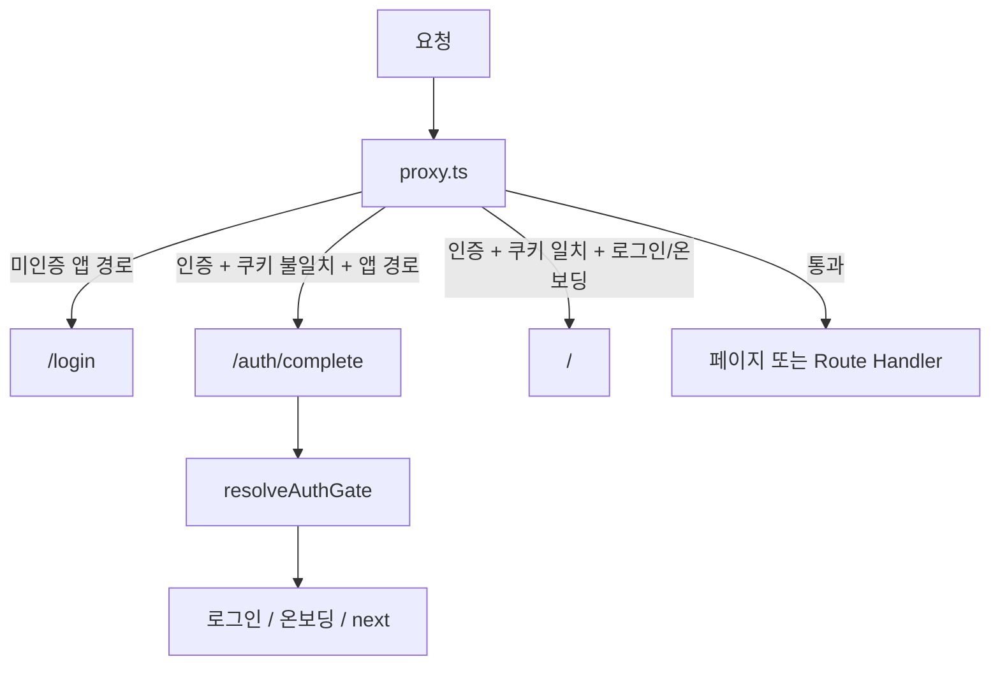
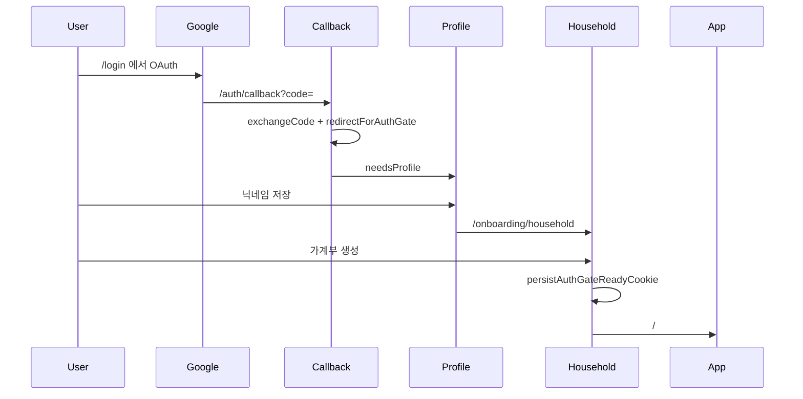

# 인증 및 온보딩

세션은 Supabase httpOnly 쿠키로 유지하고, 앱 진입 가능 여부는 `moa_gate` ready 쿠키로 기억합니다. 앱 레이아웃에서는 인증을 다시 조회하지 않습니다.

## 상태

`resolveAuthGate()`가 아래 네 가지 중 하나를 반환합니다.

| status            | 의미                              | 기본 목적지             |
| ----------------- | --------------------------------- | ----------------------- |
| `unauthenticated` | Supabase 세션 없음                | `/login`                |
| `needsProfile`    | 로그인됨, `profiles` 행 없음      | `/onboarding/profile`   |
| `needsHousehold`  | 프로필은 있음, 가계부 멤버십 없음 | `/onboarding/household` |
| `ready`           | 프로필 + 멤버십 모두 있음         | `/` 또는 `next`         |

초대 링크(`next`가 `/invite/{uuid}`)일 때는 `needsHousehold`여도 가계부 생성이 아니라 초대 페이지로 보냅니다. 초대를 수락하면 멤버십이 생깁니다.

## 쿠키 두 종류

| 쿠키                          | 역할                                            | 누가 쓰나                                             |
| ----------------------------- | ----------------------------------------------- | ----------------------------------------------------- |
| Supabase 세션 쿠키            | 로그인 여부. `getUser()`로 검증                 | `proxy.ts`, `createServerClient`, 브라우저 클라이언트 |
| `moa_gate` (`ready:{userId}`) | 온보딩 완료 여부. DB를 다시 치지 않기 위한 힌트 | `proxy.ts`가 userId와 비교                            |

`moa_gate`는 httpOnly, `SameSite=lax`, path `/`입니다. 프로덕션에서만 `Secure`입니다. 값 접두사는 `ready:`입니다.

세션 토큰은 localStorage에 두지 않습니다. 현재 가계부 id만 zustand + `localStorage` (`moa:currentHouseholdId`)에 둡니다.

RSC에서 `cookies().set`은 실패할 수 있습니다. 그래서 ready 쿠키는 Route Handler 응답(`redirectForAuthGate`) 또는 서버 액션(`persistAuthGateReadyCookie`)에서 심습니다.

## 계층

1. **proxy** — 매 매칭 요청마다 `getUser()`. DB(profile/membership)는 조회하지 않음.
2. **`/auth/complete`** — 쿠키가 없거나 userId가 다를 때만 앱 경로에서 호출. `redirectForAuthGate`가 `resolveAuthGate`를 한 번 실행.
3. **로그인 페이지** — `getUser()`만. 세션이 있으면 `/auth/complete`로 보냄.
4. **온보딩/초대 페이지** — 해당 페이지 첫 진입 시 `resolveAuthGate`로 폼 또는 리다이렉트 결정.
5. **앱 레이아웃** — 가드 없음. `AppShell`만 렌더.

## proxy

파일: [`proxy.ts`](../proxy.ts)

### matcher

`/`, `/login`, `/onboarding/:path*`, `/invite/:path*`, `/auth/:path*`, `/history`, `/stats`, `/write`, `/write/:path*`, `/calendar`, `/settings`

matcher에 없는 경로는 proxy를 타지 않습니다.

### 경로 분류

| 분류         | 경로                                            |
| ------------ | ----------------------------------------------- |
| pass-through | `/invite/*`, `/auth/*`                          |
| login        | `/login`                                        |
| onboarding   | `/onboarding/*`                                 |
| app          | 나머지 매칭 경로 (`/`, `/history`, `/write` 등) |

### 분기

**세션 없음**

- pass-through: 통과. `/auth/callback`의 코드 교환, `/auth/complete`의 미인증 처리, 초대 페이지의 로그인 유도가 가능해야 해서입니다.
- login: 통과. `moa_gate`는 삭제.
- 그 외: `/login`으로 리다이렉트하고 `moa_gate` 삭제.

**세션 있음 + `moa_gate`의 userId가 현재 user와 같음 (`isReady`)**

- login / onboarding: `/`로 리다이렉트.
- 그 외: 통과. 탭 전환 때 profile/membership을 다시 조회하지 않습니다.

**세션 있음 + 쿠키 없음 또는 userId 불일치**

- app: `/auth/complete?next={pathname}`으로 리다이렉트.
- login / onboarding / pass-through: 통과. 페이지 또는 complete 핸들러가 이어서 판별합니다.

계정 전환 시 이전 사용자의 `moa_gate`가 남아 있으면 userId가 달라져 complete를 다시 탑니다.

## resolveAuthGate

파일: [`src/features/onboarding/model/resolveAuthGate.ts`](../src/features/onboarding/model/resolveAuthGate.ts)

1. `getUser()`
2. 없으면 쿠키 삭제 시도 후 `unauthenticated`
3. `getProfile` + `listHouseholdMembersByUserId`를 병렬 조회
4. 프로필 없으면 `needsProfile`, 멤버십이 없으면 `needsHousehold`
5. 둘 다 있으면 쿠키 세팅 시도 후 `ready`

리다이렉트 경로와 Route Handler 쿠키 반영은 같은 파일의 `redirectForAuthGate`가 맡습니다. `next`는 [`getSafeNextPath`](../src/shared/lib/getSafeNextPath.ts)를 통과한 값만 씁니다.

허용되는 `next`:

- 앱 경로: `/`, `/history`, `/stats`, `/calendar`, `/settings`, `/write`, `/write/{숫자}`
- 초대: `/invite/{uuid}`

`://`, `//`, `\`, `?`, `#`가 있으면 버립니다.

## Route Handler

### `/auth/callback`

파일: [`src/app/api-routes/authCallback.ts`](../src/app/api-routes/authCallback.ts)

Google OAuth 이후 `code`를 세션으로 바꿉니다.

1. `exchangeCodeForSession(code)`
2. 실패하거나 code 없음 → `/login`
3. 성공 → `redirectForAuthGate(origin, next)` (게이트 판별 + 쿠키 + 리다이렉트)

이미 온보딩이 끝난 사용자는 여기서 쿠키를 심고 곧장 `next` 또는 `/`로 갑니다.

### `/auth/complete`

파일: [`src/app/api-routes/authComplete.ts`](../src/app/api-routes/authComplete.ts)

proxy가 앱 경로에서 쿠키를 신뢰하지 못할 때의 단일 진입점입니다.

1. `next` 검증
2. `redirectForAuthGate(origin, next)`

로그인 페이지에서 이미 로그인된 사용자, 온보딩 페이지에서 이미 `ready`인 사용자도 여기로 보냅니다. RSC에서 쿠키를 못 심는 경우를 막기 위해서입니다.

## 페이지 가드

앱 레이아웃([`app/(app)/layout.tsx`](<../app/(app)/layout.tsx>))에는 인증 가드가 없습니다.

| 경로                    | 가드                                                                                                   |
| ----------------------- | ------------------------------------------------------------------------------------------------------ |
| `/login`                | 세션이 있으면 `/auth/complete`                                                                         |
| `/onboarding/profile`   | 미인증 → 로그인. `needsHousehold` → 가계부 온보딩 또는 `next`. `ready` → complete                      |
| `/onboarding/household` | 미인증 → 로그인. `needsProfile` → 프로필. `ready` → complete                                           |
| `/invite/{token}`       | 미인증 → `/login?next=초대`. `needsProfile` → 프로필+next. `needsHousehold`와 `ready`는 초대 화면 유지 |

## 사용자 흐름

### 첫 로그인 (가계부 생성)

프로필 생성 후 `next`가 없으면 `/onboarding/household`로 갑니다. 가계부를 만들면 서버 액션으로 `moa_gate`를 심고 `/`로 이동합니다. 생성 시 zustand/localStorage에 새 `householdId`도 넣습니다.

### 재방문 (이미 ready)

1. proxy `getUser()` 성공
2. `moa_gate` userId 일치
3. 앱 페이지 통과
4. 클라이언트는 localStorage의 `householdId`로 거래/카테고리를 바로 요청하고, `listHouseholds`는 뒤에서 검증

### 초대 수락

1. `/invite/{token}` — 미인증이면 로그인에 `next`를 붙임
2. OAuth `redirectTo`에 같은 `next`가 실림
3. 콜백의 `redirectForAuthGate`가 초대 경로를 보존
4. 프로필이 없으면 프로필 온보딩 후 다시 초대 페이지 (`CreateProfileForm`의 `next`)
5. 프로필이 있고 가계부가 없어도 초대 페이지를 보여 줌
6. 수락 후 `setCurrentHouseholdId`, `persistAuthGateReadyCookie`, `/`로 이동

### 마지막 가계부 삭제/나가기

앱 셸의 [`NoHouseholdRedirect`](../src/widgets/appShell/ui/NoHouseholdRedirect.tsx)가 `listHouseholds`가 빈 배열이면 `moa_gate`를 지우고 `/onboarding/household`로 보냅니다. 설정 화면의 삭제/나가기 확인도 같은 `redirectIfNoHouseholds`를 호출합니다.

### 로그아웃

설정 계정 섹션에서

1. `clearAuthGateReadyCookie`
2. `clearCurrentHouseholdId` (zustand + localStorage)
3. Supabase `signOut` 후 `/login`

proxy도 미인증이면 `moa_gate`를 지웁니다.

## 클라이언트 householdId

온보딩이 끝난 뒤 앱 데이터 요청은 인증 가드와 별개입니다.

- 스토어: [`currentHouseholdStore`](../src/features/household/model/currentHouseholdStore.ts)
- 훅: [`useCurrentHousehold`](../src/features/household/model/useCurrentHousehold.ts)

hydrate(1프레임) 직후 저장 id가 있으면 `listHouseholds` 완료를 기다리지 않고 쿼리를 시작합니다. 목록이 오면 멤버십에 없는 id는 첫 가계부로 바꿉니다.

## 주요 파일

| 파일                                                                                                                    | 역할                                        |
| ----------------------------------------------------------------------------------------------------------------------- | ------------------------------------------- |
| [`proxy.ts`](../proxy.ts)                                                                                               | 세션 + ready 쿠키 분기                      |
| [`src/features/onboarding/model/resolveAuthGate.ts`](../src/features/onboarding/model/resolveAuthGate.ts)               | 풀 게이트, 경로 계산, `redirectForAuthGate` |
| [`src/features/onboarding/model/authGateCookie.ts`](../src/features/onboarding/model/authGateCookie.ts)                 | 서버 쿠키 set/delete                        |
| [`src/features/onboarding/model/authGateCookieActions.ts`](../src/features/onboarding/model/authGateCookieActions.ts)   | 클라이언트에서 호출하는 서버 액션           |
| [`src/features/onboarding/model/redirectIfNoHouseholds.ts`](../src/features/onboarding/model/redirectIfNoHouseholds.ts) | 멤버십 0개 → 온보딩                         |
| [`src/app/api-routes/authCallback.ts`](../src/app/api-routes/authCallback.ts)                                           | OAuth 콜백                                  |
| [`src/app/api-routes/authComplete.ts`](../src/app/api-routes/authComplete.ts)                                           | 온보딩 완료 판별                            |
| [`src/shared/config/authGateCookie.ts`](../src/shared/config/authGateCookie.ts)                                         | 쿠키 이름/옵션/값 파싱                      |
| [`src/shared/lib/getSafeNextPath.ts`](../src/shared/lib/getSafeNextPath.ts)                                             | open redirect 방지                          |
| [`src/entities/auth/api/signInWithGoogle.ts`](../src/entities/auth/api/signInWithGoogle.ts)                             | OAuth 시작                                  |
