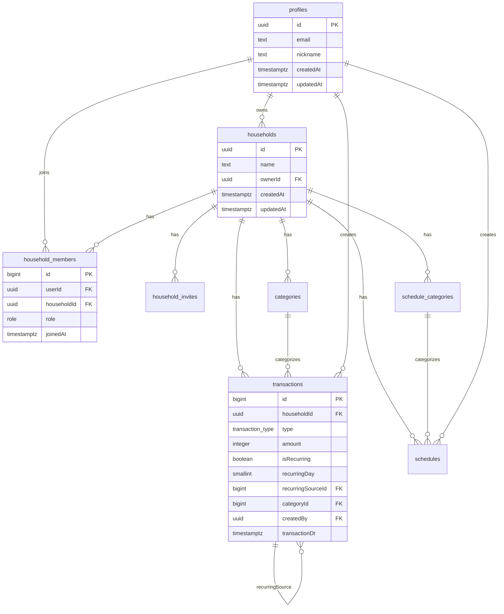
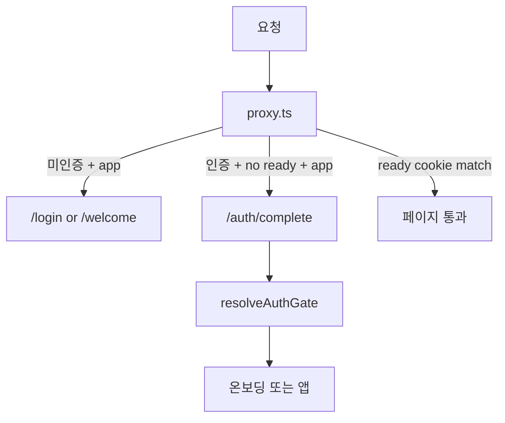
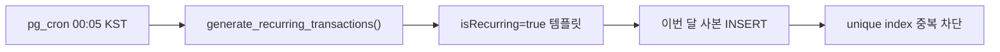

# 프로젝트 개요

**모아(Moa)** 는 그래프 중심의 공유 가계부 PWA 웹 클라이언트입니다. 한 가계부를 여러 명이 함께 쓰고, 수입·지출·저축·보험 네 가지 유형으로 거래를 기록하며, 홈 대시보드에서 차트로 소비를 분석하고, 달력에서 일정과 지출을 함께 볼 수 있습니다.

관련 문서:

- [인증 및 온보딩](./authOnboarding.md) — `proxy.ts`, `moa_gate` 쿠키, OAuth 흐름 상세
- [README](../README.md) — 빠른 시작

---

## 기술 스택

| 영역 | 기술 |
| ---- | ---- |
| 프레임워크 | Next.js **16.3** (App Router), React **19.2**, TypeScript |
| 백엔드 | Supabase (Postgres, Auth, RLS) — `@supabase/ssr`, `@supabase/supabase-js` |
| 서버 상태 | TanStack Query v5 |
| 클라이언트 상태 | Zustand (현재 가계부 ID) |
| 차트 | ECharts + echarts-for-react |
| PWA | `@ducanh2912/next-pwa` |
| 스타일 | CSS Modules |
| 린트/포맷 | ESLint, Prettier |
| 패키지 매니저 | pnpm |

**빌드 주의:** PWA 플러그인이 webpack 기반이라 `pnpm build`는 `next build --webpack`을 사용합니다. 개발 서버(`pnpm dev`)는 Turbopack을 씁니다.

---

## 디렉토리 구조와 FSD

[Feature-Sliced Design](https://feature-sliced.design/)을 따릅니다. 상위 레이어만 하위 레이어를 import할 수 있습니다.

```
app → pages → widgets → features → entities → shared
```

```
moa-web/
├── app/                    # Next.js 라우트 (thin re-export)
├── proxy.ts                # 인증 게이트 (middleware 역할)
├── src/
│   ├── app/                # FSD app 레이어 (providers, api-routes)
│   ├── pages/              # 페이지 UI·로직
│   ├── widgets/            # AppShell, SiteFooter
│   ├── features/           # useXxx 훅, 도메인 기능 조합
│   ├── entities/           # Supabase CRUD API + 모델 타입
│   └── shared/             # ui, lib, config, model, api
├── supabase/migrations/    # DB 스키마 변경 이력
└── docs/                   # 프로젝트 문서
```

### 레이어 역할

| 레이어 | 역할 | 예시 |
| ------ | ---- | ---- |
| `app/` (루트) | URL → `src/pages` re-export | `app/(app)/page.tsx` → `@/pages/home` |
| `src/pages/` | 화면 UI, 페이지 전용 훅 | `home`, `history`, `write`, `calendar`, `settings` |
| `src/widgets/` | 여러 feature를 묶는 레이아웃 | `AppShell`, `SiteFooter` |
| `src/features/` | TanStack Query mutation/query 훅 | `useCreateTransaction`, `useCurrentHousehold` |
| `src/entities/` | Supabase 테이블 CRUD | `createTransaction`, `listCategories` |
| `src/shared/` | 공통 UI·유틸·설정 | `DatePicker`, `formatAmount`, `navItems` |

### Public API 규칙

슬라이스 외부에서는 **슬라이스 루트 `index.ts`** 를 통해서만 import합니다.

```ts
// ✅ Good
import { useListCategories } from '@/features/category';

// ❌ Bad
import { useListCategories } from '@/features/category/model/useListCategories';
```

---

## 라우트 맵

### Route Group

| 그룹 | 레이아웃 | 설명 |
| ---- | -------- | ---- |
| `(app)` | `AppShell` (사이드바·하단탭·WriteFab) | 로그인 후 메인 앱 |
| `(auth)` | 루트 layout | 로그인·온보딩·초대 |
| `(marketing)` | `SiteFooter` | 랜딩·약관 (SEO 대상) |

### URL → 페이지 슬라이스

| URL | Route 파일 | `src/pages` |
| --- | ---------- | ----------- |
| `/` | `app/(app)/page.tsx` | `home` |
| `/history` | `app/(app)/history/page.tsx` | `history` |
| `/calendar` | `app/(app)/calendar/page.tsx` | `calendar` |
| `/settings` | `app/(app)/settings/page.tsx` | `settings` |
| `/write` | `app/(app)/write/page.tsx` | `write` |
| `/write/[id]` | `app/(app)/write/[transactionId]/page.tsx` | `write/edit` |
| `/stats` | `app/(app)/stats/page.tsx` | `/history`로 리다이렉트 |
| `/login` | `app/(auth)/login/page.tsx` | `login` |
| `/onboarding/profile` | `app/(auth)/onboarding/profile/page.tsx` | `createProfile` |
| `/onboarding/household` | `app/(auth)/onboarding/household/page.tsx` | `createHousehold` |
| `/invite/[token]` | `app/(auth)/invite/[token]/page.tsx` | `acceptInvite` |
| `/welcome` | `app/(marketing)/welcome/page.tsx` | `welcome` |
| `/terms` | `app/(marketing)/terms/page.tsx` | `legal` (TermsPage) |
| `/privacy` | `app/(marketing)/privacy/page.tsx` | `legal` (PrivacyPage) |
| `/auth/callback` | `app/auth/callback/route.ts` | OAuth 콜백 |
| `/auth/complete` | `app/auth/complete/route.ts` | 온보딩 게이트 판별 |

### 앱 네비게이션

하단 탭·사이드바 4개: **홈**, **내역**, **달력**, **설정** (`src/shared/config/navItems.ts`).

거래 작성은 FAB 또는 `/write` 직접 접근.

---

## 핵심 기능

### 홈 대시보드 (`/`)

월 단위로 가계부 현황을 차트로 보여줍니다.

| 구성 | 설명 |
| ---- | ---- |
| 가계부 전환 | `HouseholdPageTitle` — 드롭다운으로 가계부 전환·인라인 생성 |
| 월 네비게이션 | 이전/다음 달 (현재 월 이후 불가) |
| 잔액·스택바 | 수입 − 지출 − 저축 − 보험, 유형별 비율 |
| 자산 추이 | 최근 12개월 라인 차트 |
| KPI 링 | 수입·지출·저축·보험 비율 도넛 4종 |
| 카테고리 파이 | 지출 카테고리 비율 |
| 상위 지출 | 카테고리별 버블 차트 |
| 지출 추이 | 주간/월간 스택 막대 (기간 토글) |
| 카테고리 예산 | 예산 대비 사용률·초과 표시 |
| 최근 내역 | 이번 달 최근 5건 → `/write/:id` |

주요 파일: [`src/pages/home/`](../src/pages/home/)

### 거래 내역 (`/history`)

| 기능 | 설명 |
| ---- | ---- |
| 필터 | 유형(전체/수입/지출/저축/보험), 카테고리, 월별 이동·전체 |
| 합계 | 유형별 합계, 전체 필터 시 잔액 표시 |
| 목록 | 모바일 카드 / 데스크톱 테이블 이중 레이아웃 |
| 반복 뱃지 | 템플릿·자동 생성 사본 모두 "반복" 표시 |
| 수정 | 항목 클릭 → `/write/:id` |

주요 파일: [`src/pages/history/`](../src/pages/history/)

### 거래 작성·수정 (`/write`, `/write/[id]`)

| 필드 | 설명 |
| ---- | ---- |
| 유형 | 지출 / 수입 / 저축 / 보험 |
| 금액 | 양의 정수 |
| 날짜 | DatePicker |
| 카테고리 | 유형별 필터, 선택 안 함 가능 |
| 이름·메모 | 선택, 최대 80·200자 |
| 반복 거래 | 토글 — 거래 날짜의 **일(day)** 이 매달 반복 기준 |

반복 거래 규칙:

- **템플릿**: `isRecurring=true`, `recurringSourceId=null` — 토글 UI 표시
- **자동 생성 사본**: `recurringSourceId=원본 id` — 토글 UI 숨김, 일반 거래로 취급

주요 파일: [`src/pages/write/`](../src/pages/write/)

### 달력 (`/calendar`)

| 기능 | 설명 |
| ---- | ---- |
| 월간 그리드 | 일정 레인, 일별 지출 합계 |
| 스와이프 | 좌→다음 달, 우→이전 달 |
| 필터 | 지출 표시 on/off, 작성자, 일정 카테고리 |
| 일 상세 | 선택일 일정·지출 목록, 일정 추가 |
| 일정 CRUD | 제목, 시작/종료 날짜·시간, 메모, 카테고리 |
| 일정 카테고리 | 이름 + 색상, CRUD |

주요 파일: [`src/pages/calendar/`](../src/pages/calendar/)

### 설정 (`/settings`)

| 섹션 | 기능 |
| ---- | ---- |
| 계정 | 닉네임·이메일 표시, 로그아웃 |
| 멤버 | 목록(소유자/멤버), 이메일 초대, 추방(소유자), 대기 초대 취소 |
| 카테고리 | CRUD, 유형·예산 설정 |
| 가계부 | 소유자: 삭제 / 멤버: 나가기 |

주요 파일: [`src/pages/settings/`](../src/pages/settings/)

### 랜딩 (`/welcome`)

비로그인 사용자용 마케팅 페이지. 히어로, 하이라이트, 스크롤 연동 가계부 미리보기, 기능 그리드, 공유 가계부 안내, 달력 가이드, PWA 설치 가이드, CTA.

주요 파일: [`src/pages/welcome/`](../src/pages/welcome/)

### 온보딩·초대

| 경로 | 기능 |
| ---- | ---- |
| `/login` | Google OAuth |
| `/onboarding/profile` | 닉네임 설정 |
| `/onboarding/household` | 가계부 생성 |
| `/invite/[token]` | 초대 수락 → 해당 가계부 선택 |

상세 흐름은 [authOnboarding.md](./authOnboarding.md) 참고.

---

## 데이터 모델

Supabase Postgres. 컬럼명은 대부분 camelCase, `categories.created_at`만 snake_case.

### ER 다이어그램



### profiles

테이블: `profiles` — [`src/entities/profile/model/profile.ts`](../src/entities/profile/model/profile.ts)

| 필드 | 타입 |
| ---- | ---- |
| `id` | `string` |
| `email` | `string` |
| `nickname` | `string` |
| `createdAt` | `string` |
| `updatedAt` | `string` |

### households

테이블: `households` — [`src/entities/household/model/household.ts`](../src/entities/household/model/household.ts)

| 필드 | 타입 |
| ---- | ---- |
| `id` | `string` |
| `name` | `string` |
| `ownerId` | `string` |
| `createdAt` | `string` |
| `updatedAt` | `string` |

### household-members

테이블: `household-members` — [`src/entities/householdMember/model/householdMember.ts`](../src/entities/householdMember/model/householdMember.ts)

| 필드 | 타입 |
| ---- | ---- |
| `id` | `number` |
| `userId` | `string` |
| `householdId` | `string` |
| `role` | `HouseholdRole` |
| `joinedAt` | `string` |

### household-invites

테이블: `household-invites` — [`src/entities/householdInvite/model/householdInvite.ts`](../src/entities/householdInvite/model/householdInvite.ts)

| 필드 | 타입 |
| ---- | ---- |
| `id` | `string` |
| `householdId` | `string` |
| `email` | `string` |
| `token` | `string` |
| `invitedBy` | `string` |
| `status` | `HouseholdInviteStatus` |
| `createdAt` | `string` |
| `acceptedAt` | `string \| null` |

### categories

테이블: `categories` — [`src/entities/category/model/category.ts`](../src/entities/category/model/category.ts)

| 필드 | 타입 |
| ---- | ---- |
| `id` | `number` |
| `householdId` | `string` |
| `name` | `string` |
| `type` | `TransactionType` |
| `budget` | `number \| null` |
| `created_at` | `string` |

### transactions

테이블: `transactions` — [`src/entities/transaction/model/transaction.ts`](../src/entities/transaction/model/transaction.ts)

| 필드 | 타입 |
| ---- | ---- |
| `id` | `number` |
| `householdId` | `string` |
| `type` | `TransactionType` |
| `name` | `string \| null` |
| `amount` | `number` |
| `isRecurring` | `boolean \| null` |
| `recurringDay` | `number \| null` |
| `recurringSourceId` | `number \| null` |
| `categoryId` | `number \| null` |
| `memo` | `string \| null` |
| `createdBy` | `string` |
| `createdDt` | `string` |
| `updatedDt` | `string` |
| `transactionDt` | `string` |

### schedules

테이블: `schedules` — [`src/entities/schedule/model/schedule.ts`](../src/entities/schedule/model/schedule.ts)

| 필드 | 타입 |
| ---- | ---- |
| `id` | `number` |
| `householdId` | `string` |
| `title` | `string` |
| `memo` | `string \| null` |
| `startAt` | `string` |
| `endAt` | `string` |
| `categoryId` | `number \| null` |
| `createdBy` | `string` |
| `createdDt` | `string` |
| `updatedDt` | `string` |

### schedule-categories

테이블: `schedule-categories` — [`src/entities/scheduleCategory/model/scheduleCategory.ts`](../src/entities/scheduleCategory/model/scheduleCategory.ts)

| 필드 | 타입 |
| ---- | ---- |
| `id` | `number` |
| `householdId` | `string` |
| `name` | `string` |
| `color` | `string` |
| `createdDt` | `string` |

### 공통 enum

**TransactionType** — [`src/shared/model/transactionType.ts`](../src/shared/model/transactionType.ts)

| 값 | 라벨 |
| -- | ---- |
| `income` | 수입 |
| `expense` | 지출 |
| `saving` | 저축 |
| `insurance` | 보험 |

**HouseholdRole** — [`src/shared/model/householdRole.ts`](../src/shared/model/householdRole.ts)

| 값 | 라벨 |
| -- | ---- |
| `owner` | 소유자 |
| `member` | 멤버 |

**HouseholdInviteStatus** — [`src/entities/householdInvite/model/householdInviteStatus.ts`](../src/entities/householdInvite/model/householdInviteStatus.ts)

`'pending' | 'accepted' | 'cancelled'`

---

## 인증과 온보딩 (요약)

세션은 Supabase httpOnly 쿠키, 온보딩 완료 여부는 `moa_gate` (`ready:{userId}`) 쿠키로 기억합니다.

| status | 의미 | 기본 목적지 |
| ------ | ---- | ----------- |
| `unauthenticated` | 세션 없음 | `/login` |
| `needsProfile` | 프로필 없음 | `/onboarding/profile` |
| `needsHousehold` | 멤버십 없음 | `/onboarding/household` |
| `ready` | 프로필 + 멤버십 있음 | `/` 또는 `next` |



상세: [authOnboarding.md](./authOnboarding.md)

---

## 반복 거래 자동 생성

반복 거래는 **템플릿 + 자동 생성 사본** 구조입니다.

| 구분 | 조건 | 역할 |
| ---- | ---- | ---- |
| 템플릿 | `isRecurring=true`, `recurringSourceId IS NULL` | 매달 복제의 원본 |
| 사본 | `recurringSourceId = 원본 id` | cron이 만든 월별 거래 |

### 동작 규칙

- `recurringDay`는 거래 날짜의 **일(day)** 과 동일 (별도 선택 UI 없음)
- 템플릿 등록 **월**은 제외, **다음 달**부터 생성
- 31일 지정 시 2월 등은 해당 월 **마지막 날**로 clamp
- `(recurringSourceId, 월)` unique index로 중복 생성 방지
- cron 누락 시 이전 달 catch-up

### DB 인프라

| 파일 | 내용 |
| ---- | ---- |
| [`20260902150000_add_recurring_transaction_columns.sql`](../supabase/migrations/20260902150000_add_recurring_transaction_columns.sql) | `recurringDay`, `recurringSourceId` 컬럼, unique index |
| [`20260902150100_add_generate_recurring_transactions_function.sql`](../supabase/migrations/20260902150100_add_generate_recurring_transactions_function.sql) | `generate_recurring_transactions()` 함수 |
| [`20260902150200_schedule_recurring_transactions_cron.sql`](../supabase/migrations/20260902150200_schedule_recurring_transactions_cron.sql) | pg_cron 매일 `15:05 UTC` (= `00:05 KST`) 실행 |



---

## 상태 관리와 데이터 흐름

### 서버 상태 (TanStack Query)

features 슬라이스마다 `config/queryKeys.ts`로 캐시 키를 관리합니다. mutation 성공 시 관련 query를 invalidate합니다.

### 클라이언트 상태 (Zustand)

현재 가계부 ID: [`currentHouseholdStore`](../src/features/household/model/currentHouseholdStore.ts) + `localStorage` (`moa:currentHouseholdId`).

hydrate 직후 저장된 id로 쿼리를 시작하고, `listHouseholds` 완료 후 멤버십에 없는 id는 첫 가계부로 교체합니다.

### 세션

Supabase httpOnly 쿠키. **localStorage에 세션 토큰을 두지 않습니다.**

### API 호출 경로

```
pages (UI)
  → features (useXxx 훅)
    → entities (Supabase CRUD)
      → Supabase Postgres (RLS)
```

### Supabase RPC

| RPC | 용도 |
| --- | ---- |
| `get_household_invite_by_token` | 토큰으로 초대 조회 |
| `accept_household_invite` | 초대 수락 |

---

## 코딩 컨벤션

[`.cursor/rules/base.mdc`](../.cursor/rules/base.mdc) 기준:

| 규칙 | 내용 |
| ---- | ---- |
| 파일명 | camelCase (UI 컴포넌트만 PascalCase) |
| 함수 | 전부 화살표 함수 |
| Props 타입 | `Props` |
| FSD | 상위 → 하위 import만, 슬라이스 `index.ts` public API |
| ESLint | `func-style: expression` (function 키워드 금지) |

---

## 개발 환경

### 스크립트

```bash
pnpm install          # 의존성 설치
pnpm dev              # 개발 서버 (Turbopack)
pnpm build            # 프로덕션 빌드 (webpack + PWA)
pnpm start            # 프로덕션 서버
pnpm lint             # ESLint
pnpm format           # Prettier
pnpm og:generate      # OG 이미지 생성
```

### 환경 변수

| 변수 | 필수 | 설명 |
| ---- | ---- | ---- |
| `NEXT_PUBLIC_SUPABASE_URL` | O | Supabase 프로젝트 URL |
| `NEXT_PUBLIC_SUPABASE_PUBLISHABLE_KEY` | O | Supabase anon/publishable key |
| `NEXT_PUBLIC_SITE_URL` | - | 사이트 URL (OG, JSON-LD) |

### 주요 파일 빠른 참조

| 파일 | 역할 |
| ---- | ---- |
| [`proxy.ts`](../proxy.ts) | 인증 게이트 |
| [`src/features/onboarding/model/resolveAuthGate.ts`](../src/features/onboarding/model/resolveAuthGate.ts) | 온보딩 판별 |
| [`src/shared/config/navItems.ts`](../src/shared/config/navItems.ts) | 앱 네비게이션 |
| [`src/shared/config/site.ts`](../src/shared/config/site.ts) | 사이트 메타·SEO |
| [`src/widgets/appShell/ui/AppShell.tsx`](../src/widgets/appShell/ui/AppShell.tsx) | 앱 레이아웃 |
| [`public/manifest.json`](../public/manifest.json) | PWA manifest |
